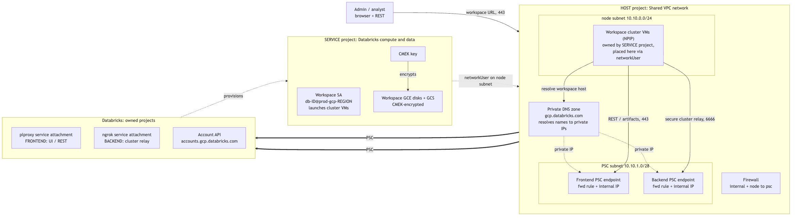

# Databricks workspace on a GCP Shared VPC (BYOVPC + PSC + CMEK)

Terraform to stand up a **most-secure** Databricks workspace on GCP using a
**Shared VPC**: the network lives in a **host project**, the workspace's compute
and storage live in a **service project**, all traffic to Databricks rides **Private
Service Connect (PSC)**, and data is encrypted with a **customer-managed key (CMEK)**.

> **Illustrative values.** All project IDs, names, CIDRs, the account ID, and the
> admin email in `terraform.tfvars` are examples — replace them before applying.
> The config is `terraform validate`-clean and is intended as a reference blueprint.

---

## Architecture

Three domains: the **host** project (network), the **service** project (Databricks
compute + CMEK), and the **Databricks** control plane (its own projects). PSC is the
private wire between your VPC and Databricks — two endpoints: a **frontend** (UI/REST)
and a **backend** (secure cluster-to-control-plane relay).



> Diagram source (editable Mermaid): [`docs/architecture.mmd`](docs/architecture.mmd)

**How PSC works here:** your VPC creates two PSC *endpoints* (consumer side); each
targets a Databricks *service attachment* (producer side). The **frontend** carries
UI/REST; the **backend** carries the secure cluster connectivity relay on `6666`. The
private DNS zone points the workspace hostnames at the private endpoint IPs, so from
inside the VPC everything resolves to `10.10.x` and never leaves the private path.

### What lives where

| Concern | Project | Resources |
|---|---|---|
| Network | **Host** | VPC, node + psc subnets, firewall, router/NAT, PSC IPs + forwarding rules, private DNS zone + records |
| Compute / data | **Service** | workspace GCE/GCS (via account API), CMEK key + storage-agent grants |
| Shared VPC glue | **Host** | host enablement + service-project attach, `compute.networkUser` on the subnet |
| Account objects | **Account** | 2 VPC endpoints, private access settings, network config, CMEK registration, workspace, admin user |

---

## Auth + prerequisites

The Databricks providers authenticate by **impersonating** a Google service account
(`google_service_account = var.google_service_account_email`). That one SA both creates
the GCP resources and authenticates to the Databricks account/workspace APIs.

### Prerequisites the host/org owner grants BEFORE apply

The automation SA must already hold enough standing permission to *run* this template —
it can't grant itself the rights it needs to create the host network and set IAM (a
self-grant would be circular), so these are prerequisites, not template resources:

- **Databricks account admin** on the account.
- On the **service** project: `Owner` (or the granular equivalent) — to create the CMEK
  key and let Databricks provision the workspace resources.
- On the **host** project: enough to create + use the network, create the private DNS
  zone, and set subnet/KMS IAM — practically `roles/compute.networkAdmin` +
  `roles/compute.networkUser` + `roles/dns.admin` + `roles/resourcemanager.projectIamAdmin`,
  or simply `Owner`.
- If Shared VPC isn't already configured, an org/folder admin with `roles/compute.xpnAdmin`
  performs the association (or set `manage_shared_vpc_association = false` and have it
  done out of band).
- Whoever runs Terraform needs **Token Creator** on the automation SA.

Impersonation is also what lets the `databricks.workspace` provider authenticate to a
brand-new workspace with no browser login, so the admin-user step runs in the same apply.

> The template does **not** grant the automation SA its own host-project network roles
> (that would be circular). It only manages IAM for *other* principals — the
> service-project agents and the Databricks workspace SA.

---

## Creation order (what each resource is for)

**Host network** — `google_compute_network.vpc` (custom-mode) → `node_subnet`
(`10.10.0.0/24`, Private Google Access on so NPIP nodes reach GCS/KMS) + `pe_subnet`
(`10.10.1.0/28`, holds the PSC IPs) → `router` + `nat` (egress for no-public-IP nodes)
→ firewall (`allow_internal` for Spark driver↔executor; `node_to_psc` on 443/6666/8443-8451).
Shared VPC is enabled on the host and the service project attached
(`manage_shared_vpc_association`; skip if the network team already did this).

**Shared VPC IAM** — `compute.networkUser` grants on the shared subnet to the principals
that attach VMs across the project boundary:
1. the service project's `cloudservices` + `compute-system` agents on the node subnet;
2. **the Databricks workspace SA** (`db-<workspace-id>@prod-gcp-<region>`) on the node
   subnet — the principal that actually launches cluster VMs, so clusters fail to start
   without it. It only exists after workspace creation, so the template grants it via the
   workspace's `gcp_workspace_sa` attribute (ordered post-create in the same apply).
   Feature-dependent extras (GKE robot, serverless VPC-access agent, …) go in
   `var.additional_network_user_service_accounts`.

**CMEK** — `key_ring` + `crypto_key` in the **service** project; encrypt/decrypt granted
to the **service** project's `compute-system` (VM disks) and `gs-project-accounts` (GCS)
agents. The `MANAGED_SERVICES` grant is auto-added by Databricks at registration.

**PSC endpoints** — two internal IPs from `pe_subnet` + two forwarding rules targeting
the region's Databricks service attachments (frontend `plproxy`, backend `ngrok`). Both
must reach `ACCEPTED`.

**Account registration** — both PSC endpoints registered (their `project_id` = **host**),
private access settings (`public_access_enabled` = your choice, **immutable** after
creation), network config (`network_project_id` = **host**), and the CMEK registration.

**Workspace** — `databricks_mws_workspaces` with `cloud_resource_container.gcp.project_id`
= **service**, wired to the network config, PAS, and both CMEK use-cases. NPIP is implied.

**Private DNS** — a `private` zone for `gcp.databricks.com.` attached to the host VPC,
with 4 A-records (workspace URL / `dp-` / `psc-auth` → frontend IP; `tunnel.<region>` →
backend IP). The zone is authoritative for that domain **inside the VPC**, so these 4 are
the complete set of `gcp.databricks.com` names resolvable there.

**Workspace admin** — the admin user is added to the workspace `admins` group via the
impersonation-based workspace provider. (Account admins have workspace-admin access
implicitly; this is for a delegated, non-account-admin admin.)

See `terraform-plan-ordered.out` for every resource block laid out in this dependency
order.

---

## Testing PSC

- **Backend (relay):** launch a cluster. Reaching `RUNNING` proves the relay path
  (`tunnel.<region>` → backend IP:6666) end to end — a NPIP node in your VPC reached the
  control plane over PSC.
- **Frontend / private DNS:** from a VM inside the host VPC (a bastion, a CI runner
  peered to the network, or a temporary instance in the node subnet):
  - `nslookup <workspace-url>` returns the **frontend PSC IP** (`10.10.1.x`), not a public IP;
  - `curl -sI https://<workspace-url>` returns a Databricks response header (e.g.
    `x-databricks-org-id`), confirming the private frontend serves the workspace.

---

## Apply

```bash
cd terraform
terraform init
terraform validate
terraform plan -out tf.plan       # review
terraform apply tf.plan
```

**Staged apply (recommended)** — foundation + KMS first; then PSC endpoints and **check
`ACCEPTED`**; then account registration; then the workspace; then DNS. Use `-target` per
group so you can inspect PSC status before the (~12–15 min) workspace step.

To confirm the workspace SA landed on the shared subnet after apply:
```bash
gcloud compute networks subnets get-iam-policy <node-subnet> --region <region> --project <host-project>
```

---

## Files

```
terraform/
├── versions.tf          providers + versions
├── providers.tf         google / google-beta / databricks (impersonation)
├── variables.tf         all inputs (host + service projects, network, PSC, CMEK, DNS)
├── terraform.tfvars     illustrative values — replace before applying
├── network.tf           HOST: shared-vpc enable/attach, VPC, subnets, firewall, NAT
├── psc.tf               HOST: PSC IPs + forwarding rules (+ status outputs)
├── kms.tf               SERVICE: CMEK key + storage service-agent grants
├── iam-shared-vpc.tf    subnet networkUser grants (service agents + workspace SA)
├── databricks.tf        account: endpoints, PAS, network, CMEK reg, workspace, admin
├── dns.tf               HOST: private zone + 4 A-records
└── outputs.tf           workspace_url/id, projects, PSC IPs, metastore

terraform-plan-ordered.out   the plan's resources in creation-dependency order
```


---

## Appendix: the automation identity (GSA) vs Databricks account admin

The service account this template impersonates (`google_service_account_email`)
needs standing in **two separate systems**, granted independently — neither implies
the other:

- **Google Cloud** — it is a GCP *service account* with the IAM roles above; this is
  what lets it create the VPC, subnets, KMS key, PSC endpoints, and DNS.
- **Databricks account** — the *same* GSA must **also** be registered in the
  Databricks account as a **user** (username = the GSA email) and granted **account
  admin**, so the `databricks` provider's calls (workspace, network config, private
  access settings, CMEK registration) are authorized.

Being a GCP service account grants it nothing in Databricks. A human account admin
performs the Databricks-side registration + account-admin grant **once** (nothing can
grant the very first account admin — chicken-and-egg); afterward the GSA runs
unattended. Terraform impersonates the one GSA for both the `google` and `databricks`
providers.

> GCP specific: a GCP GSA federates to a Databricks **user**, not a service principal
> — register it as a user, not an SP.
