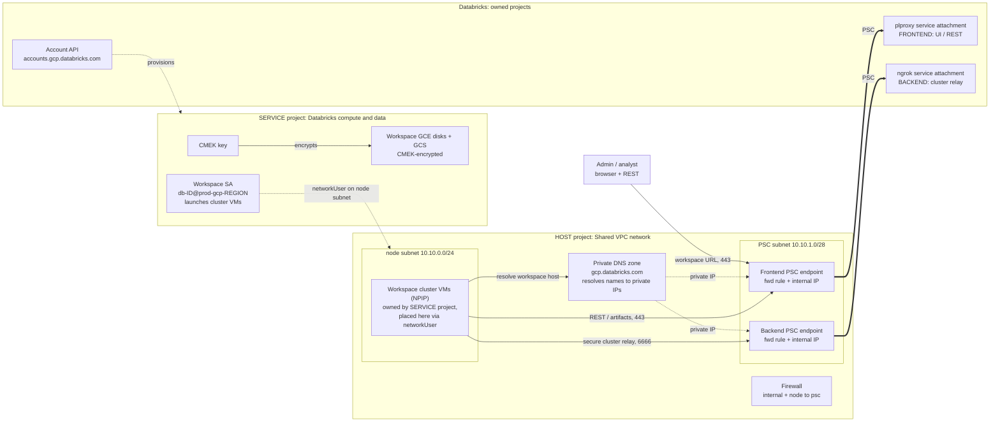

# Databricks workspace on a GCP Shared VPC (BYOVPC + PSC + CMEK)

Terraform to stand up a **most-secure** Databricks workspace on GCP using a
**Shared VPC**: the network lives in a **host project**, the workspace's compute
and storage live in a **service project**, all traffic to Databricks rides **Private
Service Connect (PSC)**, and data is encrypted with a **customer-managed key (CMEK)**.

The deployment is **split across teams** — network, security/KMS, Databricks-platform,
and identity each own their slice with a **least-privilege** identity, wired together by
output→input handoffs. No single over-privileged identity is required.

> **Illustrative values.** All project IDs, names, CIDRs, and the account ID in each
> `terraform.tfvars` are examples — replace them before applying. Every config is
> `terraform validate`-clean and is intended as a reference blueprint.

## How to deploy

Everything lives under [`multi-team/`](multi-team) — four independent Terraform root
configs, one per team, run in order:

| Phase | Config | Team |
|---|---|---|
| 1 | [`multi-team/host-network/`](multi-team/host-network) | **Network Engineering** |
| 2 | [`multi-team/service-cmek/`](multi-team/service-cmek) | **Cloud Security / KMS** *(parallel with P1)* |
| 3 | [`multi-team/databricks-account/`](multi-team/databricks-account) | **Data / Databricks Platform** |
| 4 | [`multi-team/post-workspace/`](multi-team/post-workspace) | **Network / Cloud IAM** |

- **Start here — operational index:** [`multi-team/README.md`](multi-team/README.md) —
  run order, the handoff table (which output feeds which input), and commands.
- **Full narrative:** [`docs/multi-team-runbook.md`](docs/multi-team-runbook.md) — team
  ownership, phase ordering, and the cross-team dependencies that force the order.
- **All-in-one variant:** a single-config version (one team, one automation identity)
  lives on the [`single-template`](../../tree/single-template) branch.

> **Prerequisite (Cloud Foundation, Phase 0):** the host and service projects, the Shared
> VPC association (host enablement + service-project attach), API enablement, and the
> Google service agents all **already exist** before these configs run. This repo does not
> create the projects or toggle the Shared VPC association — it builds the network, keys,
> and workspace *inside* that foundation. See the runbook for the Phase 0 checklist.

---

## Architecture

Three domains: the **host** project (network), the **service** project (Databricks
compute + CMEK), and the **Databricks** control plane (its own projects). PSC is the
private wire between your VPC and Databricks — two endpoints: a **frontend** (UI/REST)
and a **backend** (secure cluster-to-control-plane relay).

**How PSC works here:** your VPC creates two PSC *endpoints* (consumer side); each
targets a Databricks *service attachment* (producer side). The **frontend** carries
UI/REST; the **backend** carries the secure cluster connectivity relay on `6666`. The
private DNS zone points the workspace hostnames at the private endpoint IPs, so from
inside the VPC everything resolves to `10.10.x` and never leaves the private path.

### What lives where

| Concern | Project | Resources | Phase |
|---|---|---|---|
| Network | **Host** | VPC, node + psc subnets, firewall, router/NAT, PSC IPs + forwarding rules, private DNS zone | 1 |
| CMEK | **Service** | CMEK key + storage-agent grants | 2 |
| Account objects | **Account** | 2 VPC endpoints, private access settings, network config, CMEK registration, workspace | 3 |
| Cross-project IAM + DNS records | **Host** | `compute.networkUser` for the workspace SA + 4 A-records | 4 |
| Shared VPC glue (host enable + attach) | **Host** | *prerequisite* — Cloud Foundation, Phase 0 | 0 |

---

## Identity & workspace admins

There are **two different admins**, at two scopes — the deployment *requires* one and
does *not* create the other:

| | **Account admin** | **Workspace admin** |
|---|---|---|
| Scope | Whole Databricks account | This one workspace |
| Relationship | **Required** (prerequisite) | **Not** created |
| Why | Authorization to call the account API and create the workspace | Give a delegated human admin access to just this workspace |
| Needed for a working workspace? | Yes | No — the account admin already covers it |

The Data Platform identity that runs Phase 3 is an **account admin**, and account admins
hold workspace-admin implicitly on every workspace they create. So a fresh workspace is
fully administered with no extra resource — which is why nothing provisions a workspace
admin.

**To add a delegated admin** — a human who should administer *this* workspace without
being a full account admin — configure **SCIM first** so the user/group syncs into the
Databricks account, then **assign** (don't create) that synced identity as workspace
`ADMIN` over the account API. The worked example is in
[`multi-team/databricks-account/databricks.tf`](multi-team/databricks-account/databricks.tf);
the full ordering is Phase 5 in the runbook. There's no bootstrap risk — until SCIM is
live, the account admin is already a full workspace admin.

---

## Testing PSC

- **Backend (relay):** launch a cluster. Reaching `RUNNING` proves the relay path
  (`tunnel.<region>` → backend IP:6666) end to end — a NPIP node in your VPC reached the
  control plane over PSC.
- **Frontend / private DNS:** from a VM inside the host VPC (a bastion, a CI runner
  peered to the network, or a temporary instance in the node subnet):
  - `nslookup <workspace-url>` returns the **frontend PSC IP** (`10.10.1.x`), not a public IP;
  - `curl -sI https://<workspace-url>` returns a Databricks response header (e.g.
    `x-databricks-org-id`), confirming the private frontend serves the workspace.

---

## Appendix: the automation identities (GSA) vs Databricks account admin

Each config impersonates **its team's** automation service account
(`google_service_account_email`). Those SAs need standing in **two separate systems**,
granted independently — neither implies the other:

- **Google Cloud** — each is a GCP *service account* with the IAM roles for its slice
  (see the least-privilege appendix); this is what lets it create the VPC, the CMEK key,
  the PSC endpoints, the DNS, and the cross-project IAM.
- **Databricks account** — the **Data Platform** SA (used by `databricks-account/`) must
  **also** be registered in the Databricks account as a **user** (username = the GSA
  email) and granted **account admin**, so the `databricks` provider's calls (workspace,
  network config, private access settings, CMEK registration) are authorized. The other
  teams' SAs need nothing in Databricks.

Being a GCP service account grants nothing in Databricks. A human account admin performs
the Databricks-side registration + account-admin grant **once** (nothing can grant the
very first account admin — chicken-and-egg); afterward the SA runs unattended.

> GCP specific: a GCP GSA federates to a Databricks **user**, not a service principal —
> register it as a user, not an SP.

---

## Appendix: least-privilege setup (instead of `Owner`)

Rather than granting each automation SA `Owner`, scope it to specific **predefined**
roles, plus a few one-time preconditions a **project admin** sets up (an SA can't grant
these to itself). Roles are based on the
[Databricks lpw template](https://github.com/bhavink/databricks/tree/master/gcpdb4u/templates/terraform-scripts/lpw)
and map to the per-team identities used by the four configs.

### Granular roles (per team)

- **Network Engineering** (`host-network/`, `post-workspace/`) — on the **HOST** project:
  `roles/compute.networkAdmin` (VPC, subnet, firewall, addresses, PSC forwarding rules),
  `roles/compute.securityAdmin` (firewall), `roles/dns.admin` (DNS zone/records +
  private-zone VPC bind), `roles/resourcemanager.projectIamAdmin` (subnet IAM).
- **Cloud Security / KMS** (`service-cmek/`) — on the **SERVICE** project:
  `roles/cloudkms.admin` (CMEK key + `setIamPolicy`),
  `roles/resourcemanager.projectIamAdmin` (project-level role bindings).
- **Data / Databricks Platform** (`databricks-account/`) — Databricks **account admin**,
  plus `roles/serviceusage.serviceUsageConsumer` + read on the **SERVICE** project.

> Use **predefined** roles, not a hand-built custom role: two permissions the deploy
> needs — `compute.forwardingRules.pscCreate` and `dns.networks.bindPrivateDNSZone` —
> cannot be added to a custom role (they are silently dropped), so a custom "creator"
> role perpetually 403s.

### One-time prerequisites (Cloud Foundation / a project admin, Phase 0)

1. **Enable the APIs.** GCP services are off by default — you cannot create a KMS key
   while Cloud KMS is disabled, DNS zones while the DNS API is off, etc. Enable:
   `compute, iam, iamcredentials, cloudresourcemanager, serviceusage, cloudkms, dns, storage`.

2. **Create the GCP service agents before the CMEK grants.** The CMEK grants
   (`cryptoKeyEncrypterDecrypter`) target Google-managed service agents
   (`service-<num>@compute-system…` and `service-<num>@gs-project-accounts…`). GCP does
   not create these until their service is first touched, so on a fresh project the grant
   fails with `400 … service account … does not exist`. Force-create them first, e.g.
   `gcloud beta services identity create --service=storage.googleapis.com` (and the same
   for `compute` and `cloudkms`).

3. **`roles/iam.serviceAccountTokenCreator` on each SA, for its runner.** The runner —
   whoever invokes `terraform apply` (a person or a CI pipeline) — impersonates the team's
   SA rather than acting as itself; this role is what lets it do so.
