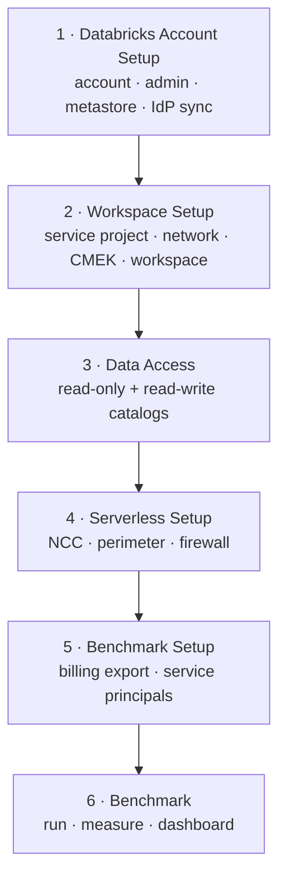

# Databricks Photon PoC — Playbook

The end-to-end plan for running the Databricks **Photon proof of concept** on your Google
Cloud environment, as an ordered set of phases. Each step has a clear **owner**, the **privileges**
it needs (GCP or Databricks), and the **output** it produces. This page is the map; every step
links to its own guide for the detail.

> Set up the Databricks **account** → stand up a **secure workspace** → give it **governed
> access** to the data → bring in **serverless** → deploy the agreed **PySpark workloads on
> Photon** (with a Spark baseline) → **measure cost and runtime** against Dataproc.

## At a glance



Each phase maps to one folder; a folder may hold several ordered sub-steps.

| Phase | Folder |
|---|---|
| 1. Databricks Account Setup | [`databricks-account-setup/`](databricks-account-setup/README.md) |
| 2. Workspace Setup | [`workspace-setup/`](workspace-setup/README.md) (steps 2.1–2.5) |
| 3. Data Access | [`data-access/`](data-access/README.md) |
| 4. Serverless Setup | [`serverless-setup/`](serverless-setup/README.md) |
| 5. Benchmark Setup | [`benchmark/prerequisites.md`](benchmark/prerequisites.md) |
| 6. Benchmark | [`benchmark/`](benchmark/README.md) |

---

## 1. Databricks Account Setup
→ [`databricks-account-setup/`](databricks-account-setup/README.md)

| Step | Prereqs | Teams | Privileges | Output |
|---|---|---|---|---|
| **1.1 Databricks Account Setup** | None | Databricks + GCP Billing Admin | None | Account, human + automation (`databricks_account_admin_sa`) admins, regional metastore, system-table schemas enabled |
| **1.2 IdP Sync** | 1.1 | Databricks + IdP Admin | **Databricks:** account admin · **IdP:** SCIM admin | Identities/groups synced; metastore owner set to a governance group |

## 2. Workspace Setup
→ [`workspace-setup/`](workspace-setup/README.md) — a secure workspace on a Shared VPC (private connectivity + CMEK), built by the platform teams in order.

| Step | Prereqs | Teams | Privileges | Output |
|---|---|---|---|---|
| **[2.1 Create service project](workspace-setup/service-project/README.md)** | 1.1 + GCP host project exists | GCP Cloud Foundations | **GCP:** project creator, billing, Shared VPC admin (org/folder) | Service project created; its APIs enabled; attached to the existing Shared VPC host; service-project number + GCS service agent |
| **[2.2 Create network](workspace-setup/network/README.md)** | service project exists | GCP Network Engineering | **GCP:** network + firewall + DNS admin (host project) | VPC + node/PSC subnets, firewall, Cloud Router+NAT, two PSC endpoints (PENDING), private DNS zone, subnet grants |
| **[2.3 CMEK](workspace-setup/cmek/README.md)** | service project exists | Cloud Security / KMS | **GCP:** KMS admin (service project) | CMEK keyring + key; compute & storage agents granted encrypt/decrypt |
| **[2.4 Workspace creation](workspace-setup/workspace/README.md)** | network + encryption keys | Databricks | **Databricks:** account admin (account API) | Workspace (URL, id, workspace SA); CMEK+PSC+network registered; assigned to the regional metastore |
| **[2.5 Post-workspace config](workspace-setup/post-workspace/README.md)** | 2.4 complete | Network Eng / Cloud IAM | **GCP:** network-user grant + DNS admin (host project) | Workspace SA `networkUser` on node subnet; DNS A-records; PSC endpoints ACCEPTED |

## 3. Data Access
→ [`data-access/`](data-access/README.md)

| Step | Prereqs | Teams | Privileges | Output |
|---|---|---|---|---|
| **[3.1 Connect to data lake (RO) + PoC bucket (RW)](data-access/README.md)** | Workspace setup complete | Data Platform + Network Security + bucket owners | **Databricks:** account admin (scoped UC CREATE grants) · **GCP:** bucket/storage IAM + VPC-SC admin | Read-only `source_data_ro` catalog + read-write `analytics` catalog; storage credentials; per-bucket VPC-SC ingress (source-pinned) |

## 4. Serverless Setup
→ [`serverless-setup/`](serverless-setup/README.md)

| Step | Prereqs | Teams | Privileges | Output |
|---|---|---|---|---|
| **[4.1 Update VPC-SC perimeter](serverless-setup/README.md)** | Workspace + data access | Network Security + Data Platform | **Databricks:** account admin (NCC) · **GCP:** VPC-SC perimeter admin | NCC bound to workspace; VPC-SC ingress source-pinned to include Databricks serverless-compute project numbers |
| **[4.2 Firewall rules for serverless](serverless-setup/README.md)** | perimeter updated | Network Security + Data Platform | **Databricks:** account admin (egress policy) · **GCP:** firewall admin (host project) | Serverless egress network policy; Databricks serverless-compute outbound IPs allowlisted on the firewall |

> **Phases 3 and 4 both touch the VPC-SC perimeter, and that's intentional.** They're kept as
> separate steps so you can reason about "data access" and "serverless" independently,
> even though the perimeter changes could be combined into one for efficiency.

## 5. Benchmark Setup
→ [`benchmark/prerequisites.md`](benchmark/prerequisites.md)

| Step | Prereqs | Teams | Privileges | Output |
|---|---|---|---|---|
| **[5.1 BigQuery billing export + view](benchmark/prerequisites.md)** | Workspace + data access complete; GCP billing export rights | GCP Billing + Security | **GCP:** billing admin + BigQuery admin | Billing export (standard or detailed); scoped authorized view; SP read on the view only |
| **[5.2 SP creation](benchmark/prerequisites.md)** | 5.1; workspace + catalogs | Databricks + GCP IAM admin | **Databricks:** account admin · **GCP:** IAM admin | 5 principals (GCP: dataproc-runner + data-collector SAs; Databricks: bench-runner, bench-collector, bench-analyst); GCP SA keys in the secret scope; run-as wired |

## 6. Benchmark
→ [`benchmark/`](benchmark/README.md)

| Step | Prereqs | Teams | Privileges | Output |
|---|---|---|---|---|
| **[6.1 Run benchmark jobs](benchmark/README.md)** | Benchmark setup complete; workloads deployed | Data Platform + GCP Dataproc | **Databricks:** bench-runner SP · **GCP:** dataproc-runner SA | Each PySpark file run 3 ways (Photon / Spark / Dataproc); runs tagged project/engine/run_id |
| **[6.2 Measure & monitor](benchmark/README.md)** | Benchmark runs complete; billing export settled | Data Platform + GCP data-collector | **Databricks:** bench-collector + bench-analyst SPs · **GCP:** data-collector SA | `analytics.benchmark.results` (DBU + GCP VM cost + runtime per run); Lakeview dashboard: Photon vs Spark vs Dataproc |

---

## Repo layout

```
databricks-account-setup/  Phase 1 — account, admin, metastore, IdP sync (account-console setup)
workspace-setup/           Phase 2 — the secure workspace (steps 2.1–2.5, each its own config)
data-access/               Phase 3 — read-only + read-write Unity Catalog catalogs over GCS
serverless-setup/          Phase 4 — serverless compute (NCC, perimeter, firewall)
benchmark/                 Phases 5–6 — deploy workloads, run, measure; setup in prerequisites.md
docs/                      architecture reference
```

> **Example values.** Project ids, names, CIDRs, and account ids in each `terraform.tfvars`
> (and in the docs) are placeholders — replace them before applying.
