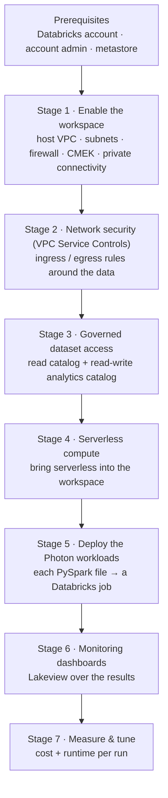

# Databricks Photon PoC — Playbook

This repository is the end-to-end plan for running the Databricks **Photon proof of concept**
with the client on Google Cloud. It takes you from an empty project to a measured result:

> Stand up a **secure workspace** → give it **governed access** to the client's data →
> deploy the agreed **PySpark workloads on Photon** (with a plain-Spark baseline) →
> **measure cost and runtime** against the client's existing Dataproc runs.

Each stage is a self-contained unit of work with a clear owner and a clear output. This page
is the map; every stage links to its own guide for the step-by-step detail.

---

## The PoC at a glance



> **Stages vs. folders.** The seven stages group into four folders, and each folder keeps its
> own internal numbering — so a folder's numbers won't always match the stage numbers above:
>
> | Stage(s) | Folder | Internal numbering |
> |---|---|---|
> | 1 | `workspace-setup-multi-team/` | five ordered sub-steps, **Phases 0–5** |
> | 2–3 | `catalog-setup/` | one config (perimeter ingress + both catalogs together) |
> | 4 | `serverless-setup/` | one config |
> | 5–7 | `benchmark/` | one bundle (deploy, dashboard, measure together) |

## Who does what

| Team | Owns |
|---|---|
| **Databricks Account Admin** | the Databricks account, account admin, metastore, service principals, and Unity Catalog grants |
| **Cloud Foundation** | GCP projects, API enablement, the Shared VPC relationship |
| **Network Engineering** | VPC, subnets, firewall, Private Service Connect, DNS |
| **Cloud Security / KMS** | the customer-managed encryption key (CMEK) |
| **Cloud / Network Security** | the VPC Service Controls perimeter and its ingress rules |
| **Data Platform** | workspace creation, serverless, catalogs, workloads, dashboards, and measurement |
| **Dataset / bucket owners** | read-only access to the client's existing data bucket |

## Prerequisites

Three Databricks-side things must exist before Stage 1: a **Databricks account**, an
**account admin**, and a **Unity Catalog metastore** in the workspace's region. They are set
up once and feed directly into the workspace stage.

→ **[docs/databricks-prerequisites.md](docs/databricks-prerequisites.md)**

**A VPC Service Controls perimeter must also already exist**, owned by the client's
**Cloud / Network Security** team. Its resource path —
`accessPolicies/<policy>/servicePerimeters/<name>` — is needed before Stage 3
(`catalog-setup`) can run.

> **Pick one GCP region and use it everywhere.** The region is a single decision that must be
> consistent across every phase — it determines the metastore region, the PSC endpoints, and
> the serverless NCC binding. Set the same region in every config's `terraform.tfvars`.

---

## Stage 1 — Enable the Databricks workspace

A secure Databricks workspace on a GCP Shared VPC: the network lives in a **host project**,
the workspace's compute and storage live in a **service project**, all traffic rides
**Private Service Connect**, and data is encrypted with a **customer-managed key**.

The work is split into ordered sub-steps, each run by the team that owns that layer:

| Sub-step | What it builds | Owner |
|---|---|---|
| Foundation | service project, API enablement, Shared VPC relationship | Cloud Foundation |
| Host network | VPC, subnets, firewall, PSC endpoints, DNS | Network Engineering |
| CMEK | the encryption key and its grants | Cloud Security / KMS |
| Workspace | the Databricks workspace itself (account API) | Data Platform |
| Handback | workspace-SA subnet grant + DNS records | Network Engineering |

**Produces:** a running workspace — its URL, id, and workspace service account.

→ **[workspace-setup-multi-team/](workspace-setup-multi-team/README.md)** · architecture in
**[docs/architecture.md](docs/architecture.md)**

## Stage 2 — Network security (VPC Service Controls)

A VPC Service Controls perimeter keeps the client's data from leaving approved projects.
Access is granted with **ingress rules**: each data bucket the workspace reads or writes gets
a rule admitting exactly the Databricks storage identity that needs it. Egress stays closed.

**Owner:** the perimeter itself is provisioned by **Cloud / Network Security**; the concrete
**ingress rules** are configured by **Data Platform** in the `catalog-setup` config, per
bucket (they travel with the storage credential that uses them). **Produces:** ingress rules
on the perimeter for each governed bucket.

→ configured in **[catalog-setup/](catalog-setup/README.md)** (same config as Stage 3)

## Stage 3 — Governed access to the datasets (read & write)

Unity Catalog governs what the workspace can see, over two catalogs:

- a **read-only** catalog over the client's **existing** data bucket — read their data without
  ever writing to it;
- a **read-write** `analytics` catalog on a **new** bucket — where PoC outputs and results land.

Each catalog is backed by a storage credential (its own Google service account) with
least-privilege bucket IAM and the matching VPC-SC ingress rule from Stage 2.

**Owner:** Data Platform (+ the bucket owners for read-only IAM). **Produces:** the
`customer_data_ro` and `analytics` catalogs.

→ **[catalog-setup/](catalog-setup/README.md)**

## Stage 4 — Serverless compute *(optional)*

Brings **serverless** into the workspace via a Network Connectivity Configuration (and an
optional serverless egress policy). This is the workspace's serverless capability; the Photon
benchmark itself runs on classic job clusters, so serverless is available but not on the
measurement path — **skip this stage if serverless compute isn't needed**.

**Owner:** Data Platform. **Produces:** an NCC bound to the workspace.

→ **[serverless-setup/](serverless-setup/README.md)**

## Stage 5 — Deploy the Photon workloads

Each agreed PySpark file becomes **one Databricks job**, deployed with **Databricks Asset
Bundles** (`databricks bundle deploy` / CI). Every file runs three ways for comparison:
**Photon**, a plain-**Spark** baseline (identical hardware), and the client's **Dataproc** run
of the same file.

**Owner:** Data Platform. **Produces:** the deployed jobs and their runs.

→ **[benchmark/](benchmark/README.md)**

## Stage 6 — Monitoring dashboards

A **Lakeview** dashboard (Databricks' built-in dashboards — the outline's "Grafana" role)
reads the results and shows per-job cost and runtime, Photon vs. Spark vs. Dataproc.

**Owner:** Data Platform. **Produces:** the results dashboard.

→ **[benchmark/](benchmark/README.md)**

## Stage 7 — Measure & tune

Collect the numbers into a single Delta table, one row per run keyed by `run_id`: **cost** =
Databricks DBU + GCP VM cost, plus **runtime**. Compare, then tune (cluster size, data layout)
and re-run.

**Owner:** Data Platform. **Produces:** `analytics.benchmark.results`.

→ **[benchmark/](benchmark/README.md)** · GCP-side setup in
**[benchmark/prerequisites.md](benchmark/prerequisites.md)**

---

## Repo layout

```
docs/                        prerequisites + architecture (the deep reference)
workspace-setup-multi-team/  Stage 1 — the secure workspace (five ordered sub-steps)
catalog-setup/               Stages 2–3 — VPC-SC ingress + the two Unity Catalog catalogs
serverless-setup/            Stage 4 — serverless compute (NCC)
benchmark/                   Stages 5–7 — deploy workloads, dashboards, measure & tune
```

> **Example values.** Project ids, names, CIDRs, and account ids in each `terraform.tfvars`
> (and in the docs) are placeholders — replace them before applying.
