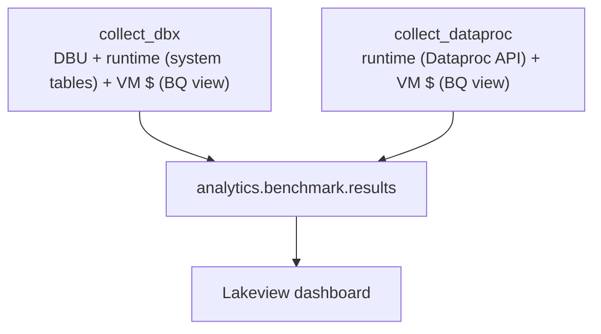

# 5–6. Benchmark Setup & Benchmark

> ← Back to the [PoC playbook](../README.md)

**Purpose:** deploy the agreed PySpark workloads, run them on Photon / Spark / Dataproc, and
measure cost and runtime per run.
**Owner:** Data Platform (+ GCP Dataproc for the Dataproc runs).
**Produces:** the deployed jobs, the `analytics.benchmark.results` table, and a Lakeview
dashboard over it.

This is the testing layer, packaged as a **Databricks Asset Bundle**:
`databricks bundle deploy` pushes the jobs and dashboard; `databricks bundle run` executes them.

> **Phase 5 — Benchmark Setup** (the BigQuery billing export + scoped view, and the
> service-principal creation) is prerequisite plumbing, documented in
> **[prerequisites.md](prerequisites.md)**. Phases 6.1–6.2 below are the run and the measurement.

## 6.1 · Run benchmark jobs

Each PySpark file is **one Databricks job with one task**. The same file runs three ways:

| # | Where | Engine | How |
|---|---|---|---|
| 1 | Databricks | **Spark** (STANDARD) | `bundle run sample_job` with `engine=STANDARD`, `engine_tag=spark` |
| 2 | Databricks | **Photon** | `bundle run sample_job` with `engine=PHOTON`, `engine_tag=photon` |
| 3 | Dataproc | Spark | `bundle run run_dataproc` — bench-runner submits the same file |

Runs 1 and 2 use **identical, fixed hardware** (node types, worker count, DBR version — all
bundle variables), so the engine is the only variable, matched to the Dataproc cluster in #3.

### The Dataproc run — orchestrated from Databricks

`bundle run run_dataproc` (run as **`bench-runner`**, via the **`gcp-dataproc-runner`** SA key)
runs `src/submit_dataproc.py`, which per run:

- **creates an ephemeral Dataproc cluster** — hardware matched to the Databricks job clusters
  (same machine types + worker count), labeled `project`/`engine=dataproc`/`run_id`, and
  auto-deleted on idle. The `run_id` on the **cluster** is what lands it on the VM billing rows
  (Dataproc *job* labels don't reach the VMs), so per-run VM cost is attributable;
- **submits** the same PySpark file to it (job id = `run_id`);
- **grants** the `gcp-data-collector` SA `dataproc.jobs.get` on that job only (per-job IAM);
- **records the `run_id`** in `analytics.benchmark.dataproc_runs`, so `collect_dataproc` picks it up automatically — no ids to copy by hand.

The submit is a call to `dataproc.googleapis.com`, reachable from classic Databricks compute
over Private Google Access (no public egress needed).

## 6.2 · Measure & monitor

Every run lands one row in `analytics.benchmark.results` (see `sql/results_table.sql`), keyed
by `run_id`. Cost has two parts:

- **Databricks runs:** DBU \$ (`system.billing.usage`, keyed by `job_run_id`) + runtime
  (`system.lakeflow.job_run_timeline`) **+** VM \$ (the BigQuery billing view).
- **Dataproc runs:** runtime (from the Dataproc Jobs API) **+** VM $ (same billing view).

`run_id` is the join key on both cost sources: on Databricks it is injected as a VM label via
the `{{job.run_id}}` dynamic reference (equal to `usage_metadata.job_run_id`); on Dataproc it
is the Dataproc job id set as a label. Per-run cost is therefore unambiguous.



The **Lakeview** dashboard over `analytics.benchmark.results` shows per-job total cost as a
stacked bar (Databricks DBU + GCP VM) with the Dataproc bar beside it, plus runtime and
price-performance views. It deploys with the bundle (dashboard-as-code). Tune from there —
cluster size, data layout — and re-run; each iteration is a one-line change plus `bundle run`.

## Identities (run-as, separation of duties)

Five principals — two GCP service accounts and three Databricks service principals. People
only trigger jobs and view results; each Databricks SP reads only its own GCP key from the
secret scope.

| Principal | Type | Does | Access |
|---|---|---|---|
| `gcp-dataproc-runner` | GCP SA | create the ephemeral cluster + submit the job (from a Databricks job) | project-level: `dataproc.clusters.create`/`delete` + `dataproc.jobs.create` + `dataproc.jobs.setIamPolicy`; plus `actAs` on the cluster VM SA |
| `gcp-data-collector` | GCP SA | Dataproc runtimes + BigQuery costs | `dataproc.jobs.get` (per-job) + BigQuery view read |
| `bench-runner` | Databricks SP | runs the Photon/Spark jobs + submits Dataproc | read `customer_data_ro`, write `analytics.workloads`; reads only the `benchmark_runner` scope |
| `bench-collector` | Databricks SP | materializes the results table | write `analytics.benchmark`, read system tables; reads only the `benchmark_collector` scope |
| `bench-analyst` | Databricks SP | builds the dashboard | read `analytics.benchmark` only |

Creating the principals, assigning the SPs to the workspace, the runner's
`allow-cluster-create` entitlement, enabling the system schemas, running the grants, and the
secret ACLs are all in **[prerequisites.md](prerequisites.md)**.

## Layout

```
databricks.yml            bundle: variables (engine, compute, Dataproc, dashboard) + dev/prod
resources/
  sample_job.yml          the workload job (1 file → 1 task); retries, nodes, failure email, tags
  run_dataproc.yml        the Dataproc submit job (bench-runner)
  collectors.yml          the two cost collectors as on-demand jobs
  dashboard.yml           the Lakeview dashboard resource
src/
  sample_job.py           minimal, engine-agnostic pyspark workload
  submit_dataproc.py      submit the file to Dataproc + label + per-job IAM (bench-runner)
  collect_dbx.py          system tables (DBU) + BQ view (VM) → results
  collect_dataproc.py     Dataproc API (runtime) + BQ view (VM) → results
  bq_billing.py           shared: read VM cost per run_id from the scoped BQ view
sql/
  results_table.sql       schemas + the results & dataproc_runs (run-tracking) tables
  grants.sql              least-privilege grants for the service principals
dashboard/
  benchmark.lvdash.json   the Lakeview dashboard (Photon vs Spark vs Dataproc)
prerequisites.md          Phase 5 setup: BigQuery export/view, GCP SAs, service principals, secrets
```

## How to run

Complete the Phase 5 setup first — **[prerequisites.md](prerequisites.md)** (BigQuery billing
export, scoped billing view, service principals + secrets, Dataproc per-job IAM). Then:

```bash
# 0) one-time: create schemas + tables (sql/results_table.sql), THEN grants (sql/grants.sql)

# 1) deploy, then run the two Databricks engines
databricks bundle deploy
databricks bundle run sample_job                                          # Photon (default)
databricks bundle run sample_job -- --var="engine=STANDARD" --var="engine_tag=spark"

# 2) submit the same file to Dataproc (bench-runner); records the run_id in the tracking table
databricks bundle run run_dataproc

# 3) after runs + billing export settle, collect costs (run_ids come from the tracking table)
databricks bundle run collect_dbx
databricks bundle run collect_dataproc
```

## Notes

- **Example values — replace before applying** (bundle variables and the identifiers in
  `prerequisites.md`).
- **Attribution is concurrency-proof:** DBU is keyed by `job_run_id`, and every VM (each
  Databricks job cluster and each ephemeral Dataproc cluster) carries the `run_id` label.
  Running engines **one at a time** is still recommended for *runtime* hygiene — concurrent
  runs can contend for shared GCS bandwidth / quota and skew wall-clock — but it's no longer
  required for clean cost attribution.
- The collectors need `google-cloud-bigquery` / `google-cloud-dataproc`, declared as job
  libraries in `resources/collectors.yml`.
