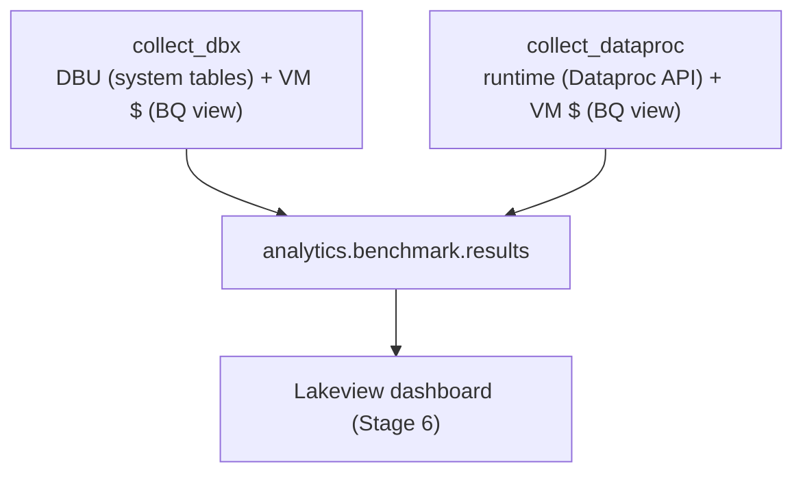

# Stages 5–7 — Deploy the workloads, measure & tune

> ← Back to the [PoC playbook](../README.md)

**Purpose:** deploy the agreed PySpark workloads, run them on Photon / Spark / Dataproc, and
measure cost and runtime per run.
**Owner:** Data Platform.
**Produces:** the deployed jobs, the `analytics.benchmark.results` table, and a Lakeview
dashboard over it.

This is the testing layer. It is packaged as a **Databricks Asset Bundle**:
`databricks bundle deploy` pushes the jobs and dashboard; `databricks bundle run` executes them.

## Stage 5 — Deploy the Photon workloads

Each PySpark file is **one Databricks job with one task**. The same file runs three ways:

| # | Where | Engine | How |
|---|---|---|---|
| 1 | Databricks | **Spark** (STANDARD) | `bundle run` with `engine=STANDARD`, `engine_tag=spark` |
| 2 | Databricks | **Photon** | `bundle run` with `engine=PHOTON`, `engine_tag=photon` |
| 3 | Dataproc | Spark | submitted on GCP by the client, same file |

Runs 1 and 2 use **identical, fixed hardware** (node types, worker count, DBR version — all
bundle variables), so the engine is the only variable, matched to the Dataproc cluster in #3.

### Dataproc side — client responsibilities

The Dataproc run (#3) is executed by the **client's** team, not from this repo. For a fair,
attributable comparison:

- **Match the hardware** — size the Dataproc cluster to the Databricks clusters (same machine
  types and worker count).
- **Label the cluster/job** with `project`, `engine=dataproc`, and `run_id=<dataproc job id>`
  so the run's VM cost is attributable in the billing view.
- **Set the per-job IAM policy** for the collector service principal after submitting each job
  — see [prerequisites.md §4](prerequisites.md#4-dataproc-per-job-access-the-submitters-extra-step).

## Stage 6 — Monitoring dashboard

A **Lakeview** dashboard over `analytics.benchmark.results` shows per-job total cost as a
stacked bar (Databricks DBU + GCP VM) with the Dataproc bar beside it, plus runtime and
price-performance views. It deploys with the bundle (dashboard-as-code) and reads the results
that Stage 7 populates.

## Stage 7 — Measure & tune

Every run lands one row in `analytics.benchmark.results` (see `sql/results_table.sql`), keyed
by `run_id`. Cost has two parts:

- **Databricks runs:** DBU $ (from `system.billing.usage`, keyed by `job_run_id`) **+** VM $
  (from the BigQuery billing view).
- **Dataproc runs:** runtime (from the Dataproc Jobs API) **+** VM $ (same billing view).

`run_id` is the join key on both cost sources: on Databricks it is injected as a VM label via
the `{{job.run_id}}` dynamic reference (equal to `usage_metadata.job_run_id`); on Dataproc it
is the Dataproc job id the submitter puts in the label. Per-run cost is therefore unambiguous.



Tune from there — cluster size, data layout — and re-run; the table and dashboard make each
iteration a one-line change plus `bundle run`.

## Identities (run-as, separation of duties)

Three Databricks service principals run the work; people only trigger jobs and view results.

| SP | Runs as | Access |
|---|---|---|
| `bench-runner` | the workload jobs | read `customer_data_ro`, write `analytics.workloads` |
| `bench-collector` | the collectors | write `analytics.benchmark`, read system tables, read the secret scope |
| `bench-analyst` | the dashboards | read `analytics.benchmark` only |

Set `runner_sp` / `collector_sp` in `databricks.yml` to the SPs' application ids. Creating the
SPs, assigning them to the workspace, the runner's `allow-cluster-create` entitlement,
enabling the system schemas, running the grants, and the secret ACL are all in
**[prerequisites.md](prerequisites.md)**.

## Layout

```
databricks.yml            bundle: variables (engine, compute, collector config) + dev/prod
resources/
  sample_job.yml          the workload job (1 file → 1 task); retries, nodes, failure email, tags
  collectors.yml          the two cost collectors as on-demand jobs
src/
  sample_job.py           minimal, engine-agnostic pyspark workload
  collect_dbx.py          system tables (DBU) + BQ view (VM) → results
  collect_dataproc.py     Dataproc API (runtime) + BQ view (VM) → results
  bq_billing.py           shared: read VM cost per run_id from the scoped BQ view
sql/
  results_table.sql       DDL for analytics.benchmark.results
  grants.sql              schemas + least-privilege grants for the three SPs
prerequisites.md          GCP-side setup + the three service principals
```

## How to run

Complete the GCP-side setup first — **[prerequisites.md](prerequisites.md)** (BigQuery billing
export, scoped billing view, GCP service account + secret, Dataproc per-job IAM, and the three
service principals). Then:

```bash
# 0) one-time: create the results table (sql/results_table.sql) and run grants (sql/grants.sql)

# 1) deploy, then run the two Databricks engines
databricks bundle deploy
databricks bundle run sample_job                                          # Photon (default)
databricks bundle run sample_job -- --var="engine=STANDARD" --var="engine_tag=spark"

# 2) the client submits the same file on Dataproc, then sets the per-job IAM policy for the SP

# 3) after runs + billing export settle, collect costs
databricks bundle run collect_dbx
databricks bundle run collect_dataproc -- --job-name=<name> --run-ids=<id1,id2,...>
```

Step 2's per-job IAM policy is the client's responsibility — see
[prerequisites.md §4](prerequisites.md#4-dataproc-per-job-access-the-submitters-extra-step).

## Notes

- **Example values — replace before applying** (bundle variables and the identifiers in
  `prerequisites.md`).
- **Run the engines one at a time** on a given file so each run's window is clean (this matters
  only for the GCP VM-cost half; the DBU half is keyed by `job_run_id` regardless).
- The collectors need `google-cloud-bigquery` / `google-cloud-dataproc`, declared as job
  libraries in `resources/collectors.yml`.
