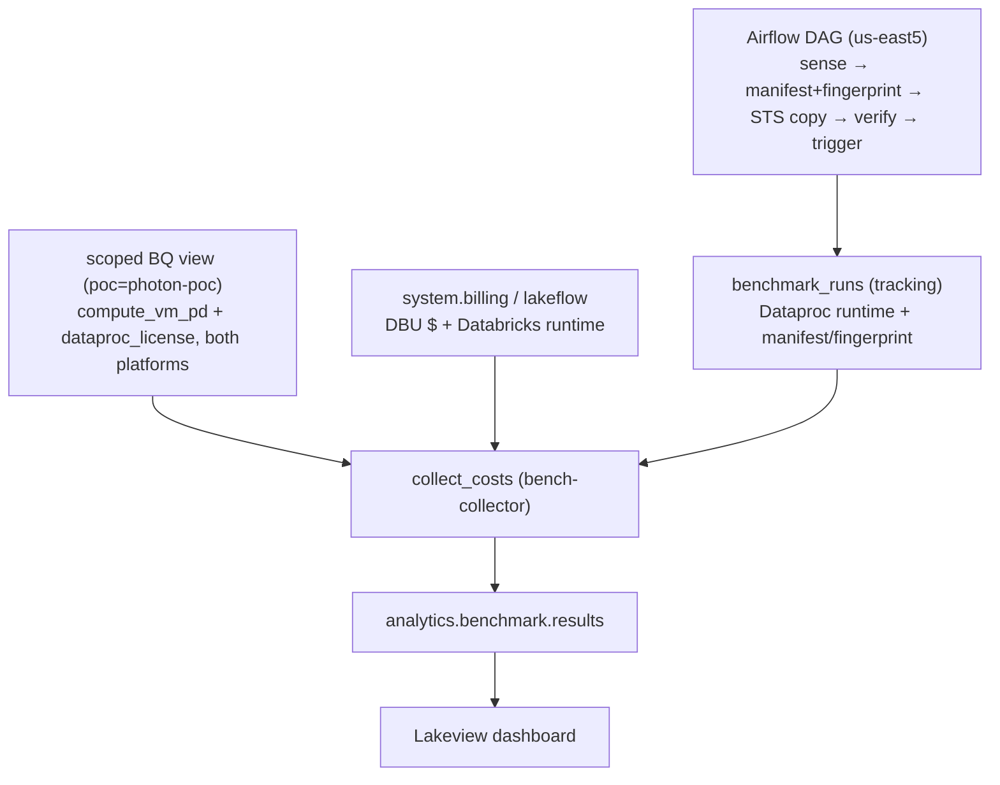

# 5–6. Benchmark Setup & Benchmark

> ← Back to the [PoC playbook](../README.md)

**Purpose:** run the agreed PySpark workload on Databricks **Photon** and **Spark**, compare it
against Yahoo's **Dataproc** run of the *same input*, and measure cost and runtime per run.
**Owner:** Data Platform (+ Yahoo's Airflow/Dataproc team for the observed Dataproc side).
**Produces:** the deployed Databricks jobs, the Airflow orchestration, the
`analytics.benchmark.results` table, and a Lakeview dashboard over it.

> **What changed from the single-region design.** We **no longer submit Dataproc**. Yahoo's
> Dataproc jobs run **in the background in us-east5**; the Databricks PoC runs in **us-east4**.
> **Airflow** (Cloud Composer) is the orchestrator: it senses each Dataproc job finishing, copies
> that job's **exact input** to us-east4 (Storage Transfer Service), verifies the copy, then
> triggers the Databricks Photon/Spark runs. The old `submit_dataproc.py` / `run_dataproc.yml`
> (Databricks-orchestrated Dataproc) is **retired**. On the cost side this collapses two GCP
> service accounts to **one collector SA** (see [prerequisites.md](prerequisites.md)).

The Databricks side is still a **Databricks Asset Bundle**: `databricks bundle deploy` pushes the
jobs and dashboard. What changes is *who triggers the runs* — **Airflow**, not `bundle run`.

> **Phase 5 — Benchmark Setup** (BigQuery billing export + the scoped view, the collector SA, the
> Databricks SPs, and the Airflow/STS prerequisites) is documented in
> **[prerequisites.md](prerequisites.md)**. Phases 6.1–6.2 below are the run and the measurement.

## 6.1 · Run benchmark jobs

The same PySpark file runs three ways, but only **two are ours to run**:

| # | Where | Engine | How |
|---|---|---|---|
| 1 | Databricks | **Spark** (STANDARD) | Airflow `DatabricksRunNowOperator`, `engine=STANDARD`, `engine_tag=spark` |
| 2 | Databricks | **Photon** | Airflow `DatabricksRunNowOperator`, `engine=PHOTON`, `engine_tag=photon` |
| 3 | Dataproc | Spark | **observed** — Yahoo's background run in us-east5; we don't submit it |

Runs 1 and 2 use **identical, fixed hardware** (node types, worker count, DBR version — all bundle
variables), so the engine is the only variable, matched to the observed Dataproc cluster in #3.

### The Airflow DAG — orchestrated from Yahoo's Cloud Composer

Per benchmarked Dataproc job, the DAG (Yahoo-side, us-east5):

1. **`wait_for_dataproc`** — downstream of Yahoo's `DataprocSubmitJobOperator` (or a
   `DataprocJobSensor`). Also **captures runtime** from `status_history` (RUNNING→terminal) — Airflow
   owns the job, so no collector grant is needed. This is why the collector never calls Dataproc.
2. **`capture_input_manifest`** — Airflow already knows the input path (it templated the closed,
   immutable partition, e.g. `dt={{ ds }}`). It lists the objects (name + generation + CRC32C + size)
   into `manifest.csv` and computes a **source fingerprint**.
3. **`sts_copy`** — Storage Transfer Service, **manifest-driven**, us-east5 → us-east4, into a
   run-scoped prefix `gs://<analytics-bucket>/benchmark/<benchmark_run_id>/`. STS checksum-verifies
   every object.
4. **`verify_fingerprint`** (gate) — recompute the fingerprint on the destination; **fail the DAG
   if it differs**. This is the "same exact set of files" guarantee — Databricks won't fire on a
   bad copy.
5. **`run_databricks_photon` / `run_databricks_spark`** — `DatabricksRunNowOperator`, pointing the
   job at the **manifest / run-scoped prefix** (not `prefix/*`), passing the tracking params below.

The benchmarked Dataproc job must run on an **ephemeral cluster labeled `poc=photon-poc` +
`engine=dataproc`** (one per run, auto-deleted) so its VM + license cost is cleanly attributable —
see [prerequisites.md §1](prerequisites.md). Airflow sets those labels when it creates the cluster.

### Same-input guarantee (manifest + fingerprint)

The source dataset is live, so "copy the prefix" would race additions/rewrites. Instead the DAG
pins the **exact object set** the Dataproc job read (a closed partition → immutable in practice;
generation-pinned if needed), copies **only** that set via the STS manifest, and **gates** on a
fingerprint match. The fingerprint is recorded on the run row, so `results` *proves*
Dataproc-input == Databricks-input.

## 6.2 · Measure & monitor

Every run lands one row in `analytics.benchmark.results` (see `sql/results_table.sql`), keyed by
`run_id`. Cost is assembled from **one scoped BigQuery view** (all GCP costs, both platforms) plus
**Databricks system tables** (DBU), with **Dataproc runtime supplied by Airflow**:

- **Databricks runs:** DBU \$ (`system.billing.usage`, keyed by `job_run_id`) + runtime
  (`system.lakeflow.job_run_timeline`) **+** GCP VM/PD \$ (the scoped view, `compute_vm_pd`).
- **Dataproc runs:** runtime (from the **tracking table**, captured by Airflow — *not* a Dataproc
  API call) **+** GCP \$ from the same view: `compute_vm_pd` **+** `dataproc_license`.

**Attribution keys.** `poc=photon-poc` scopes the view (least privilege — the collector sees only
our clusters); `engine` splits **dataproc vs databricks** (and photon vs spark); the per-run key is
the **Dataproc cluster uuid** or the Databricks **`job_run_id`**. Compute Engine rows carry `poc`
for *both* platforms, so `engine` (not `poc`) is what tells Dataproc VM cost apart from Databricks
VM cost. `run_id` maps back to the tracking table to attach the manifest/fingerprint and Dataproc
runtime.

> **DBU is not in the view.** The scoped view captures all **GCP** cost (Dataproc VM+PD+license,
> Databricks VM+PD). The Databricks **DBU $** — the engine-license layer — comes from
> `system.billing.usage`, read by the collector with its **Databricks** identity (no GCP SA). So:
> **Dataproc total** = `compute_vm_pd + dataproc_license`; **Databricks total** = `compute_vm_pd + DBU $`.

### The tracking table = the correlation key

`submit_dataproc` used to mint the `run_id`. Now **Airflow** mints a `benchmark_run_id` that ties
everything together, written to `analytics.benchmark.benchmark_runs` by the Databricks job (it has
UC creds and knows its own `job_run_id`):

| col | source | used for |
|---|---|---|
| `benchmark_run_id` | Airflow run_id | joins everything |
| `dataproc_job_id`, `cluster_uuid`, `dataproc_region` | Airflow (job placement) | Dataproc VM+license via uuid in the view |
| `dataproc_duration_s` | **Airflow, captured at job-end** | no collector Dataproc call |
| `input_window_start/end`, `manifest_uri`, `fingerprint` | Databricks job (from params) | identical-input proof |
| `sts_job_id` | Databricks job (from params) | transfer/egress cost line |
| `dbx_job_run_id` | Databricks job (self) | DBU + VM$ key |

### Photon coverage

Unchanged (in-job, **Approach A**): `sample_job` walks the executed physical plan, counts `Photon*`
operator nodes vs the total, and appends `photon_coverage_pct` + `photon_fallback_ops` to
`analytics.benchmark.photon_coverage` keyed by `run_id`; `collect_costs` joins it into `results`.
The **Spark baseline** comes out ~0%; **Dataproc** rows are NULL (no Photon engine). See the
Approach-B (time-weighted) upgrade note in the original design if a faithful time fraction is needed.

### Cross-region overhead (a separate line, on purpose)

The copy exists **only because** Databricks can't run in us-east5. Track its cost — **STS transfer +
inter-region egress** and **duplicated-dataset storage** in us-east4 — as a **distinct** bucket
(label the STS job / dest bucket `poc=photon-poc`; it lands in the same view as its own
`cost_bucket`). Report it *separately* so the engine comparison stays clean: it's **migration
overhead**, not part of Databricks' per-run compute number.



The **Lakeview** dashboard over `analytics.benchmark.results` shows per-job total cost as a stacked
bar — Databricks (DBU + VM/PD) beside Dataproc (VM/PD + license) — plus runtime, price-performance,
Photon-coverage, and the cross-region overhead line. It deploys with the bundle.

## Identities (run-as, separation of duties)

**One GCP service account** and three Databricks service principals — down from five. Airflow (its
Composer SA + a Databricks trigger credential) drives the orchestration; people only view results.

| Principal | Type | Does | Access |
|---|---|---|---|
| `gcp-data-collector` | GCP SA | GCP costs (both platforms) from the scoped view | `bigquery.dataViewer` on the view + `bigquery.jobUser`. **No `dataproc.*`** |
| `bench-runner` | Databricks SP | runs the Photon/Spark jobs (triggered by Airflow); writes the tracking row + Photon coverage | read `source_data_ro`, write `analytics.workloads` + `benchmark_runs` + `photon_coverage`. **No secret scope** |
| `bench-collector` | Databricks SP | materializes `results` | write `analytics.benchmark`, read system tables; reads only `benchmark_collector` |
| `bench-analyst` | Databricks SP | builds the dashboard | read `analytics.benchmark` only |
| Airflow (Composer) | GCP SA + Databricks cred | orchestrates: sense, manifest, STS, verify, trigger | Dataproc read + label; GCS r/w; STS; VPC-SC ingress; `CAN_MANAGE_RUN` on the Databricks job |

Creating the principals, the SP↔workspace assignment, the runner's `allow-cluster-create`, enabling
the system schemas, the grants, and the (single) secret ACL are all in
**[prerequisites.md](prerequisites.md)**.

## Layout

```
databricks.yml            bundle: variables (engine, compute, dashboard, dest prefix) + dev/prod
resources/
  sample_job.yml          the workload job (1 file → 1 task); tags poc/engine/run_id
  collectors.yml          the cost collector as an on-demand job
  dashboard.yml           the Lakeview dashboard resource
src/
  sample_job.py           engine-agnostic pyspark workload + in-job Photon coverage; writes the tracking row
  collect_costs.py        scoped BQ view (GCP $, both platforms) + system tables (DBU + Databricks runtime)
                          + tracking table (Dataproc runtime, manifest/fingerprint) → results
  bq_billing.py           shared: read GCP cost per run_id (by engine + cost_bucket) from the scoped view
sql/
  results_table.sql       schemas + results, benchmark_runs (tracking) & photon_coverage tables
  grants.sql              least-privilege grants for the service principals
dashboard/
  benchmark.lvdash.json   the Lakeview dashboard (Photon vs Spark vs Dataproc + migration overhead)
prerequisites.md          Phase 5 setup: billing export/view, the collector SA, SPs, Airflow/STS
airflow/                  the DAG (sense → manifest → STS → verify → trigger) — runs in Yahoo's Composer
```

> **Retired from the single-region design:** `src/submit_dataproc.py`, `resources/run_dataproc.yml`,
> the `gcp-dataproc-runner` SA, the `benchmark_runner` secret scope + its key, the per-job
> `dataproc.jobs.get` role, and the old `dataproc_runs` table (replaced by `benchmark_runs`).
> `collect_dbx.py` + `collect_dataproc.py` merge into a single **`collect_costs.py`** — one view now
> holds both platforms' GCP cost, and Dataproc runtime comes from the tracking table.

## How to run

Complete the Phase 5 setup first — **[prerequisites.md](prerequisites.md)**. Then:

```bash
# 0) one-time: create schemas + tables (sql/results_table.sql), THEN grants (sql/grants.sql)

# 1) deploy the Databricks jobs + dashboard (definitions only; Airflow triggers the runs)
databricks bundle deploy

# 2) deploy the DAG to Yahoo's Cloud Composer (airflow/). Per Dataproc job it:
#    senses completion + duration → captures manifest + fingerprint → STS copy us-east5→us-east4
#    → verify gate → triggers the Databricks Photon and Spark runs (which write the tracking row)

# 3) after runs + billing export settle, collect costs (run_ids come from benchmark_runs)
databricks bundle run collect_costs
```

## Notes

- **Example values — replace before applying** (bundle variables, the `poc`/`engine` label values,
  the billing view name, and the identifiers in `prerequisites.md`).
- **Attribution is concurrency-proof and cross-platform:** DBU is keyed by `job_run_id`; every VM
  (Databricks job clusters + the ephemeral Dataproc cluster) carries `poc` + `engine` + a per-run
  key, so one scoped view separates Dataproc VM/PD/license from Databricks VM/PD. Extract labels as
  **scalar subqueries** and group on a single key — the flattened export repeats cost once per label
  (Dataproc stamps three), so `CROSS JOIN UNNEST` + `SUM` would triple-count.
- **Billing latency** — the view reflects usage hours-to-~a-day later, so `collect_costs` is
  on-demand, after the runs and export settle. Dataproc **runtime** is not subject to this (Airflow
  captured it live).
- **Same billing account** — the us-east5 Dataproc project and us-east4 Databricks project must
  share a billing account for one view/one SA to cover both (else two views).
- The collector needs `google-cloud-bigquery`, declared as a job library in `resources/collectors.yml`.
```
