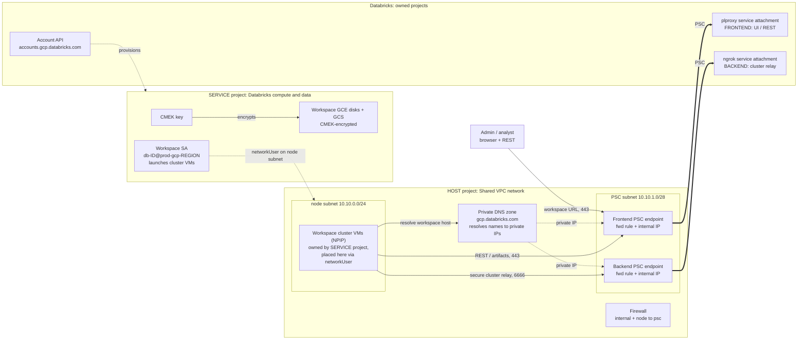

# Architecture

> ← Back to the [PoC playbook](../README.md) · detail for [Stage 1](../workspace-setup-multi-team/README.md)

Three domains: the **host** project (network), the **service** project (Databricks
compute + CMEK), and the **Databricks** control plane (its own projects). PSC is the
private wire between your VPC and Databricks — two endpoints: a **frontend** (UI/REST)
and a **backend** (secure cluster-to-control-plane relay).

**How PSC works here:** your VPC creates two PSC *endpoints* (consumer side); each
targets a Databricks *service attachment* (producer side). The **frontend** carries
UI/REST; the **backend** carries the secure cluster connectivity relay on `6666`. The
private DNS zone points the workspace hostnames at the private endpoint IPs, so from
inside the VPC everything resolves to `10.10.x` and never leaves the private path.

## What lives where

| Concern | Project | Resources | Phase |
|---|---|---|---|
| Foundation | **Host + Service** | service project, API enablement, Shared VPC host+attach, GCS service agent | 0 |
| Network | **Host** | VPC, node + psc subnets, firewall, router/NAT, PSC IPs + forwarding rules, private DNS zone | 1 |
| CMEK | **Service** | CMEK key + storage-agent grants | 2 |
| Account objects | **Account** | 2 VPC endpoints, private access settings, network config, CMEK registration, workspace | 3 |
| Cross-project IAM + DNS records | **Host** | `compute.networkUser` for the workspace SA + 4 A-records | 4 |

## Testing PSC

- **Backend (relay):** launch a cluster. Reaching `RUNNING` proves the relay path
  (`tunnel.<region>` → backend IP:6666) end to end — a NPIP node in your VPC reached the
  control plane over PSC.
- **Frontend / private DNS:** from a VM inside the host VPC (a bastion, a CI runner
  peered to the network, or a temporary instance in the node subnet):
  - `nslookup <workspace-url>` returns the **frontend PSC IP** (`10.10.1.x`), not a public IP;
  - `curl -sI https://<workspace-url>` returns a Databricks response header (e.g.
    `x-databricks-org-id`), confirming the private frontend serves the workspace.
