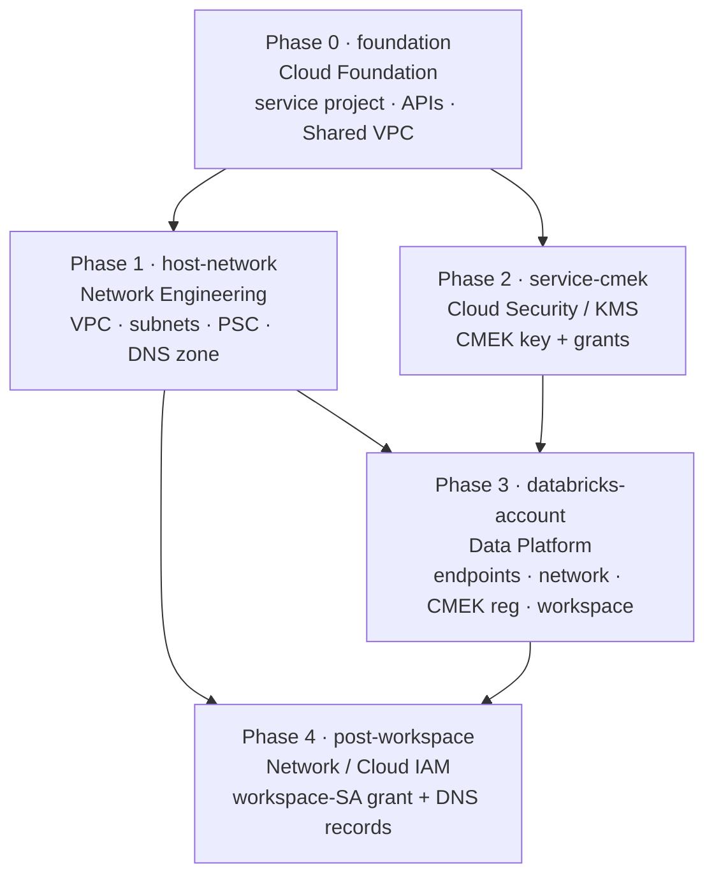

# Multi-team deployment

**Five independent Terraform configs** so each team runs only its slice with only its
own least-privilege identity. No single over-privileged identity (account-admin +
Owner-on-service + network-admin-on-host) is ever required.

For the *why* and the full narrative, see
[`../docs/multi-team-runbook.md`](../docs/multi-team-runbook.md). This page is the
operational index.

## The configs

| Order | Folder | Team | Creates |
|---|---|---|---|
| Phase 0 | [`foundation/`](foundation/README.md) | **Cloud Foundation** | service project, API enablement, Shared VPC host+attach, GCS service agent |
| Phase 1 | [`host-network/`](host-network/README.md) | **Network Engineering** | VPC, subnets, firewall, NAT, PSC endpoints, DNS zone, static subnet grants |
| Phase 2 | [`service-cmek/`](service-cmek/README.md) | **Cloud Security / KMS** | CMEK key + service-agent grants *(parallel with Phase 1)* |
| Phase 3 | [`databricks-account/`](databricks-account/README.md) | **Data / Databricks Platform** | endpoint regs, PAS, network config, CMEK reg, workspace |
| Phase 4 | [`post-workspace/`](post-workspace/README.md) | **Network / Cloud IAM** | workspace-SA subnet grant + DNS records |

> **Prerequisite:** the **host project already exists** (Phase 0 references it, does not
> create it). One-time Databricks-side setup — registering the account and making the Data
> Platform SA an account admin — is also assumed done; see [identity & access](../docs/identity-and-access.md).
>
> **Phase 5 (Enterprise Identity)** — SCIM/SSO + delegated-admin assignment — runs out of
> band on its own timeline. See the runbook.

## Run order



Phase 0 comes first. Phases 1 and 2 are then independent (no edge between them, so they
run in parallel). Phase 3 consumes both. Phase 4 consumes Phases 1 and 3. After Phase 3,
re-check the Phase-1 PSC status outputs — they flip **PENDING → ACCEPTED** once the
endpoints are registered.

## Handoffs (which output feeds which input)

| Produced by | Output | Consumed by (as input) |
|---|---|---|
| Phase 0 | `service_project_id`, `service_project_number` | Phases 1, 2, 3 |
| Phase 1 | `host_project`, `vpc_name`, `node_subnet_name`, `workspace_pe`, `relay_pe` | Phase 3 |
| Phase 1 | `node_subnet_name`, `private_zone_name`, `dns_name`, `frontend_pe_ip`, `backend_pe_ip` | Phase 4 |
| Phase 2 | `cmek_key_id` | Phase 3 |
| Phase 3 | `gcp_workspace_sa`, `workspace_url` | Phase 4 |

Each downstream config declares these as plain input variables (see its
`terraform.tfvars`), so every folder is self-contained and `terraform validate`-clean.

## Running a phase

Each folder is a standard root config:

```bash
cd foundation          # (then host-network / service-cmek / databricks-account / post-workspace)
terraform init
terraform apply -var-file=terraform.tfvars
terraform output       # copy the outputs into the next phase's tfvars
```

### Wiring handoffs automatically (optional)

Instead of copying outputs by hand, downstream configs can read upstream state
read-only. Add to `databricks-account/` or `post-workspace/`:

```hcl
data "terraform_remote_state" "network" {
  backend = "gcs"
  config  = { bucket = "yahoo-tfstate-network", prefix = "databricks/host-network" }
}
# then reference e.g. data.terraform_remote_state.network.outputs.workspace_pe
```

The only thing that crosses a team boundary is published **output data** — never a shared
credential or a shared state file.
