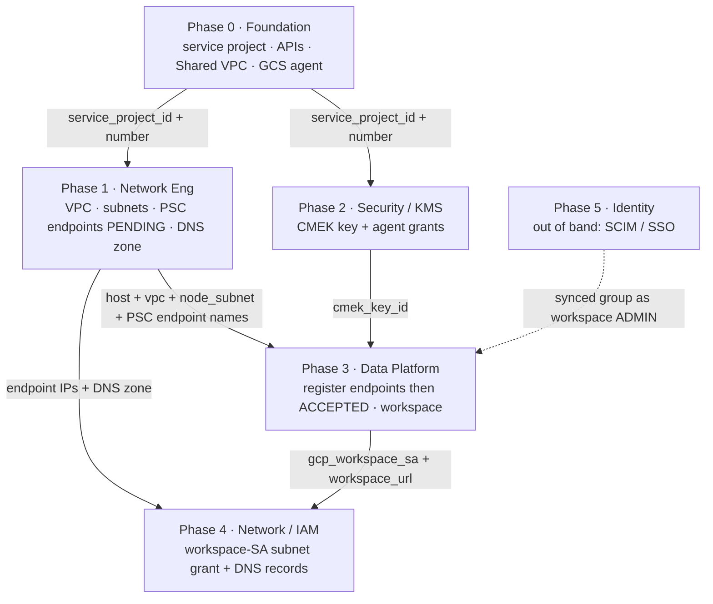

# Stage 1 — Enable the Databricks workspace

> ← Back to the [PoC playbook](../README.md)

**Purpose:** stand up a secure Databricks workspace on a GCP Shared VPC — private
connectivity (PSC), customer-managed encryption (CMEK), and no public exposure.
**Owner:** split across the platform teams (see the map below).
**Produces:** a running workspace — its URL, id, and workspace service account — ready for
Unity Catalog (Stage 3).

The work is **split across teams** — each team runs one Terraform config with only its own
least-privilege identity, and teams hand off **data** (Terraform outputs), never shared
credentials or shared state.

Each phase below links to its config's README for the full inputs, outputs, and commands.

---

## Team ↔ slice map

| Slice | Config / resources | Team | Standing identity it needs |
|---|---|---|---|
| **0. Foundation** | [`foundation/`](foundation/README.md) — create the service project, enable its APIs, attach it to the existing Shared VPC host, provision the GCS service agent. The **host project already exists** (and its APIs are already enabled) | **Cloud Foundation / Landing Zone** | org/folder: `resourcemanager.projectCreator`, `billing.user`, `compute.xpnAdmin`, `resourcemanager.projectIamAdmin` |
| **1. Host network** | [`host-network/`](host-network/README.md) — VPC, subnets, firewall, router, NAT, PSC IPs + forwarding rules, DNS **zone**, static service-agent subnet grants | **Network Engineering** | `compute.networkAdmin` + `compute.securityAdmin` + `dns.admin` on **HOST** |
| **2. CMEK** | [`service-cmek/`](service-cmek/README.md) — keyring, key, grants to service-project compute-system + gs-project-accounts agents | **Cloud Security / KMS** | `cloudkms.admin` on **SERVICE** |
| **3. Databricks account + workspace** | [`databricks-account/`](databricks-account/README.md) — VPC-endpoint regs, private access settings, network config, CMEK registration, workspace, metastore | **Data / Databricks Platform** | Databricks **account admin** — no GCP project roles (this phase only calls the account API) |
| **4. Post-workspace handback** | [`post-workspace/`](post-workspace/README.md) — workspace-SA `networkUser` subnet grant + DNS **records** (4 A-records) | **Network Engineering / Cloud IAM** | `compute.networkAdmin` + `dns.admin` on **HOST** |
| **5. Identity** | SCIM/SSO provisioning; delegated-admin assignment (`databricks_mws_permission_assignment`) | **Enterprise Identity / IT (Okta/Entra)** + Data Platform | IdP admin; account admin for the assignment |

> The role names above are the least-privilege set — use **predefined** roles, not a
> hand-built custom role: two permissions the deploy needs — `compute.forwardingRules.pscCreate`
> and `dns.networks.bindPrivateDNSZone` — can't be added to a custom role (they're silently
> dropped), so a custom "creator" role perpetually 403s.

---

## Why it's a pipeline, not six independent buttons

Three dependencies cross team boundaries. They are the reason the phases are ordered:

1. **PSC status is a two-team round-trip.** Network Eng creates the forwarding rules
   in Phase 1; they sit **PENDING**. They flip to **ACCEPTED** only after the Data
   Platform team *registers* those endpoints in the Databricks account (Phase 3),
   which auto-approves the connection. So "verify `ACCEPTED`" is a Network-Eng check
   performed **after** Phase 3.
2. **The workspace SA doesn't exist until the workspace does.** `db-<workspace-id>@prod-gcp-<region>`
   is minted by Phase 3, but it needs `roles/compute.networkUser` on the **host**
   subnet — Network Eng's resource. That grant is therefore Phase 4 (a handback),
   not Phase 1. Clusters cannot launch until it lands.
3. **DNS records need both sides.** The A-records need the PE IPs (Phase 1) **and**
   the workspace URL (Phase 3), so the *records* are Phase 4 even though the *zone*
   is Phase 1.

Everything else is parallel: **Phases 1 and 2 are independent** (network vs. KMS),
and **Phase 5 (SCIM/SSO)** runs on its own timeline entirely.

---

## Ordering with handoffs



Phases 1 and 2 branch off Phase 0 with no edge between them, so they run in parallel.
Registering the endpoints in Phase 3 is what flips the Phase-1 PSC forwarding rules from
**PENDING** to **ACCEPTED**. Phase 4 is the handback that makes clusters able to launch and
hostnames resolve. Phase 5 is out of band — once SCIM has synced a group, the Data Platform
team assigns it as workspace `ADMIN` over the account API.

---

## Step-by-step

Each phase heading links to its config's README, which has the full inputs, outputs, and
exact commands. The summaries below are the cross-phase view.

### Phase 0 — Cloud Foundation / Landing Zone → [`foundation/`](foundation/README.md)

Runs with an org/folder-level identity. The **host project already exists** and is only
referenced; this config creates and wires everything else the later phases assume:

1. **Create the service project** (`google_project`) under an org or folder, linked to a
   billing account.
2. **Enable the APIs** on the service project (`compute, dns, cloudkms, iam, iamcredentials,
   cloudresourcemanager, serviceusage, storage`). The host's APIs are already enabled.
3. **Attach to the Shared VPC** — attach the service project to the existing Shared VPC host
   (`roles/compute.xpnAdmin`).
4. **Provision the service agents** — the GCS agent via a data source, and the compute
   agent by enabling the Compute API — so Phase 2's CMEK grants don't fail with
   `400 does not exist`.

**Handoff (outputs):** `service_project_id`, `service_project_number`, `host_project`.

### Phase 1 — Network Engineering → [`host-network/`](host-network/README.md)

Runs with a host-project network identity. The host project and the Shared VPC association
already exist (Phase 0); this config only creates the network **inside** the host project.

1. `network.tf` — VPC (custom mode), node subnet (`/24`, Private Google Access on),
   PSC subnet (`/28`), firewall (`allow_internal`, `node_to_psc`), router + NAT.
2. `psc.tf` — two internal IPs from the PSC subnet + two forwarding rules targeting the
   region's Databricks service attachments (frontend `plproxy`, backend `ngrok`). These
   will report **PENDING** until Phase 3.
3. `dns.tf` — the **private zone** for `gcp.databricks.com.` bound to the VPC. (Records
   come in Phase 4.)
4. `iam.tf` — the **static** subnet `networkUser` grants to the service
   project's `<num>@cloudservices` and `service-<num>@compute-system` agents (these need
   only the service project number, no workspace).

**Handoff (outputs):** `host_project`, `vpc_name`, `node_subnet_name`, `workspace_pe`,
`relay_pe`, `frontend_pe_ip`, `backend_pe_ip`, `private_zone_name`, `dns_name`.

### Phase 2 — Cloud Security / KMS → [`service-cmek/`](service-cmek/README.md)  *(parallel with Phase 1)*

Runs with `cloudkms.admin` on the service project.

1. `kms.tf` — keyring + crypto key in the **service** project; grant encrypt/decrypt to
   the service project's `compute-system` (VM disks) and `gs-project-accounts` (GCS)
   agents. (The `MANAGED_SERVICES` grant is added by Databricks at registration in
   Phase 3.)

**Handoff (output):** `cmek_key_id` (the full KMS resource id).

### Phase 3 — Data / Databricks Platform → [`databricks-account/`](databricks-account/README.md)

Runs with the Databricks **account admin** identity. Reads Phase 0 + 1 + 2 outputs
(via `terraform_remote_state` or passed tfvars).

1. `databricks.tf` — register both PSC endpoints (`project_id` = **host**), register the
   CMEK key (`use_cases = ["STORAGE","MANAGED_SERVICES"]`), create the private access
   settings (`public_access_enabled` — **immutable**), create the network config
   (`network_project_id` = **host**), then the workspace (`cloud_resource_container` =
   **service**), and the optional metastore assignment.
2. **Verify:** the Phase-1 PSC forwarding rules should now be **ACCEPTED**. If they are
   still PENDING, the endpoint registration/network config didn't match — reconcile
   before proceeding.

**Handoff (outputs):** `workspace_id`, `workspace_url`, `gcp_workspace_sa`.

### Phase 4 — Network Engineering / Cloud IAM handback → [`post-workspace/`](post-workspace/README.md)

Runs with the host-project network identity again. Reads Phase 3 + Phase 1 outputs.

1. `iam.tf` — grant `roles/compute.networkUser` on the host **node subnet** to
   the workspace SA (`gcp_workspace_sa` from Phase 3). Clusters cannot start without this.
2. `dns.tf` — the four A-records: workspace URL / `dp-<num>` / `<region>.psc-auth` →
   frontend IP; `tunnel.<region>` → backend IP.

**Result:** clusters launch (backend relay works) and workspace hostnames resolve to the
private PSC IPs inside the VPC (frontend works).

### Phase 5 — Enterprise Identity / IT (out of band, any time)

1. Configure SCIM in Okta/Entra so users **and groups** sync into the Databricks
   **account** (account-scoped, one-time). Optionally configure SSO/unified login.
2. Once a group (e.g. `platform-admins`) has synced, the **Data Platform** team assigns
   it as workspace `ADMIN` over the account API (reference read-only, don't manage the
   synced object as a Terraform resource — see the worked example in
   [`databricks-account/databricks.tf`](databricks-account/databricks.tf)). There is no
   bootstrap risk: until SCIM is live, the account admin from Phase 0 is already a full
   workspace admin.

---

## Running the phases

Each folder is a standard root config; run them in order (Phase 2 can run alongside Phase 1):

```bash
cd foundation          # then host-network / service-cmek / databricks-account / post-workspace
terraform init
terraform apply -var-file=terraform.tfvars
terraform output       # feed the outputs into the next phase (see its README's Inputs)
```

## Handoff mechanism

Each root config has its **own backend/state** and its team's pipeline. Downstream
configs read upstream outputs read-only via `terraform_remote_state`:

```hcl
# databricks-account/ reading the network team's published state (read-only):
data "terraform_remote_state" "network" {
  backend = "gcs"
  config  = { bucket = "example-tfstate-network", prefix = "databricks/host-network" }
}

# ...then reference, e.g.:
#   data.terraform_remote_state.network.outputs.workspace_pe
#   data.terraform_remote_state.network.outputs.frontend_pe_ip
```

The only thing that crosses a team boundary is published **output data** — never a shared
credential, a shared state file, or a shared over-privileged identity.

## Layout

This folder contains one root config per phase, each with its own state, backend, and team identity:

```
foundation/          # Phase 0 — Cloud Foundation  (org/folder identity)
host-network/        # Phase 1 — Network Eng       (host-project network identity)
service-cmek/        # Phase 2 — Security / KMS    (service-project cloudkms.admin)
databricks-account/  # Phase 3 — Data Platform     (account-admin identity)
post-workspace/      # Phase 4 — Network / IAM     (host-project network identity)
```
