# 2. Workspace Setup

> ← Back to the [PoC playbook](../README.md)

**Purpose:** stand up a secure Databricks workspace on a GCP Shared VPC — private
connectivity (PSC), customer-managed encryption (CMEK), and no public exposure — using the
**least-privilege** workspace-creation flow.
**Owner:** split across the platform teams (see the map below).
**Produces:** a running workspace — its URL, id, and workspace service account — ready for
data access (Phase 3).

The work is **split across teams** — each team runs one Terraform config with only its own
least-privilege identity, and teams hand off **data** (Terraform outputs), never shared
credentials or shared state.

Each step below links to its config's README for the full inputs, outputs, and commands.

---

## The least-privilege flow is a two-phase workspace standup

This is the key thing to understand about the ordering. In a least-privilege deployment the
workspace **creator** identity holds only **read-only** GCP roles — it cannot build the
workspace's storage or compute. The identity that does is the **workspace service account**,
which Databricks mints *during* creation. So the workspace is stood up in **two applies of the
same `workspace/` config**, with the operator-role grants in between:

1. **Create, paused (step 2.4, `finalize=false`)** — Databricks creates the workspace in
   `PROVISIONING` and returns the workspace SA (`gcp_workspace_sa`) *without* provisioning any
   GCS/GCE resources.
2. **Grant the workspace SA its operator roles (steps 2.5–2.7)** — project + resource roles on
   the service project (2.5), the network role on the subnet (2.6), and the CMEK key grant (2.7).
3. **Finalize (step 2.8, `finalize=true`)** — re-apply `workspace/`; `expected_workspace_status`
   flips to `RUNNING` and the now-authorized workspace SA builds the buckets/VMs → workspace RUNNING.

Applying `finalize=true` before steps 2.5–2.7 exist will fail — the workspace SA can't create its
storage/compute. Reference: [Create a least-privilege workspace on GCP](https://docs.databricks.com/gcp/en/admin/workspace/create-least-privilege-workspace)
(requires Databricks Terraform provider **≥ 1.95.0** for `expected_workspace_status`).

---

## Team ↔ step map

| Step | Config / resources | Team | Standing identity it needs |
|---|---|---|---|
| **2.1 · Create service project** | [`service-project/`](service-project/README.md) — create the service project, enable its APIs, attach it to the existing Shared VPC host, provision the GCS service agent, **and define + grant the read-only workspace-creator role on the service project**. The **host project already exists** | **Cloud Foundation / Landing Zone** | org/folder: `resourcemanager.projectCreator`, `billing.user`, `compute.xpnAdmin`, `resourcemanager.projectIamAdmin`, `serviceusage.serviceUsageAdmin`, **`iam.roleAdmin`** |
| **2.2 · Create network** | [`network/`](network/README.md) — VPC, subnets, firewall, router, NAT, PSC IPs + forwarding rules, DNS **zone**, static service-agent subnet grants, **and the read-only workspace-creator role on the host project** | **Network Engineering** | `compute.networkAdmin` + `compute.securityAdmin` + `dns.admin` + **`iam.roleAdmin`** on **HOST** |
| **2.3 · CMEK** | [`cmek/`](cmek/README.md) — keyring, key, grants to service-project compute-system + gs-project-accounts agents | **Cloud Security / KMS** | `cloudkms.admin` on **SERVICE** |
| **2.4 · Create the workspace (PHASE 1)** | [`workspace/`](workspace/README.md) with `finalize=false` — VPC-endpoint regs, private access settings, network config, CMEK registration, workspace created **paused in PROVISIONING** | **Data / Databricks Platform** | Databricks **account admin** + the read-only creator roles from 2.1/2.2 (no other GCP roles) |
| **2.5 · Workspace SA operator roles** | [`workspace-sa-roles/`](workspace-sa-roles/README.md) — define + grant the **project role** and the workspace-scoped **resource role** (`storage.buckets.create`, `compute.instances.create`, …) to the workspace SA on the **service** project | **Cloud IAM** | `iam.roleAdmin` + `resourcemanager.projectIamAdmin` on **SERVICE** |
| **2.6 · Post-workspace config** | [`post-workspace/`](post-workspace/README.md) — workspace-SA **network role** on the node subnet + DNS **records** (4 A-records) | **Network Engineering / Cloud IAM** | `compute.networkAdmin` + `dns.admin` + `iam.roleAdmin` on **HOST** |
| **2.7 · MANAGED_SERVICES CMEK grant** | [`cmek-workspace-grant/`](cmek-workspace-grant/README.md) — workspace-SA `cryptoKeyEncrypterDecrypter` on the CMEK key (managed-services encryption) | **Cloud Security / KMS** | `cloudkms.admin` on **SERVICE** |
| **2.8 · Finalize the workspace (PHASE 2)** | [`workspace/`](workspace/README.md) with `finalize=true` — re-apply → `RUNNING`; assign the metastore | **Data / Databricks Platform** | Databricks **account admin** |

> Your identities and groups arrive earlier, in **Phase 1.2 (IdP Sync)** — they're
> already in the account by the time you reach here. Assigning a synced group as workspace
> `ADMIN` is a one-line account-API step the Data Platform team can do any time after 2.8
> (until then, the account admin from Phase 1 is already a full workspace admin).

> The GCP role names above are the least-privilege set — use **predefined** roles plus the
> custom roles this phase defines. Two permissions the deploy needs —
> `compute.forwardingRules.pscCreate` and `dns.networks.bindPrivateDNSZone` — can't be added to
> a custom role (they're silently dropped), so keep those on predefined roles.

---

## Why it's a pipeline, not eight independent buttons

The cross-team dependencies are the reason the steps are ordered:

1. **The creator must be able to read before it can create.** The workspace creator SA (step 2.4)
   holds only the read-only creator roles from steps 2.1 (service project) and 2.2 (host project).
   Those grants must exist *before* step 2.4 or creation fails validation.
2. **The workspace SA doesn't exist until the workspace does.** `db-<workspace-id>@prod-gcp-<region>`
   is minted by step 2.4 (PHASE 1). Its operator roles — project + resource (step 2.5), network
   (step 2.6), CMEK (step 2.7) — can only be granted afterward, and are what let it build the
   workspace's storage/compute.
3. **PSC status is a two-team round-trip.** Network Eng creates the forwarding rules in step 2.2;
   they sit **PENDING**. They flip to **ACCEPTED** when the Data Platform team *registers* those
   endpoints in step 2.4 (PHASE 1), which auto-approves the connection.
4. **DNS records need both sides.** The A-records need the PE IPs (step 2.2) **and** the workspace
   URL (step 2.4), so the *records* are step 2.6 even though the *zone* is step 2.2.
5. **Finalize needs every operator grant.** Step 2.8 (`finalize=true`) can only bring the workspace
   to `RUNNING` once steps 2.5, 2.6, and 2.7 have granted the workspace SA the roles it uses to
   create buckets/VMs and encrypt managed-services data.

Steps **2.2 and 2.3 are independent** (network vs. KMS) and run in parallel. Steps **2.5, 2.6, and
2.7** all depend only on step 2.4's outputs and run in parallel with each other. Step **2.8** gates
on all three.

---

## Ordering with handoffs

```mermaid
flowchart TB
    P0["2.1 · Create service project<br/>service project · APIs · Shared VPC · GCS agent · creator role (service)"]
    P1["2.2 · Create network<br/>VPC · subnets · PSC endpoints PENDING · DNS zone · creator role (host)"]
    P2["2.3 · CMEK<br/>CMEK key + agent grants"]
    P3["2.4 · Create the workspace (PHASE 1)<br/>register endpoints → ACCEPTED · workspace PROVISIONING · returns SA"]
    P4["2.5 · Workspace SA operator roles<br/>project + resource roles on SERVICE project"]
    P5["2.6 · Post-workspace config<br/>workspace-SA network role + DNS records"]
    P6["2.7 · MANAGED_SERVICES CMEK grant<br/>workspace-SA encrypterDecrypter on the key"]
    P7["2.8 · Finalize the workspace (PHASE 2)<br/>re-apply finalize=true → RUNNING · assign metastore"]

    P0 -->|"service_project_id + number + creator role"| P1
    P0 -->|"service_project_id + number"| P2
    P0 -->|"creator role (service)"| P3
    P1 -->|"host + vpc + node_subnet + PSC names + creator role (host)"| P3
    P2 -->|"cmek_key_id"| P3
    P3 -->|"gcp_workspace_sa + workspace_id"| P4
    P3 -->|"gcp_workspace_sa + endpoint IPs + DNS zone"| P5
    P2 -->|"cmek_key_id"| P6
    P3 -->|"gcp_workspace_sa"| P6
    P4 --> P7
    P5 --> P7
    P6 --> P7
```



Steps 2.2 and 2.3 branch off step 2.1 with no edge between them, so they run in parallel.
Registering the endpoints in step 2.4 (PHASE 1) flips the step-2.2 PSC forwarding rules from
**PENDING** to **ACCEPTED**. Steps 2.5, 2.6, and 2.7 all depend only on step 2.4's outputs and run
in parallel; step 2.8 finalizes the workspace once all three have landed.

---

## Step-by-step

Each step heading links to its config's README, which has the full inputs, outputs, and
exact commands. The summaries below are the cross-step view.

### 2.1 — Cloud Foundation / Landing Zone → [`service-project/`](service-project/README.md)

Creates the service project, enables its APIs, attaches it to the existing Shared VPC host,
provisions the GCS + compute service agents, and **defines + grants the read-only workspace-creator
role on the service project** to the creator SA (`databricks_account_admin_sa`).

**Handoff (outputs):** `service_project_id`, `service_project_number`, `host_project`.

### 2.2 — Network Engineering → [`network/`](network/README.md)  *(parallel with step 2.3)*

Builds the network inside the host project (VPC, subnets, firewall, router+NAT, two PSC endpoints
[**PENDING**], private DNS zone, static service-agent subnet grants) and **defines + grants the
read-only workspace-creator role on the host project** to the creator SA.

**Handoff (outputs):** `host_project`, `vpc_name`, `node_subnet_name`, `workspace_pe`,
`relay_pe`, `frontend_pe_ip`, `backend_pe_ip`, `private_zone_name`, `dns_name`.

### 2.3 — Cloud Security / KMS → [`cmek/`](cmek/README.md)  *(parallel with step 2.2)*

Keyring + crypto key in the **service** project; encrypt/decrypt granted to the service project's
`compute-system` (VM disks) and `gs-project-accounts` (GCS) agents — the `STORAGE` use case only.
The `MANAGED_SERVICES` grant goes to the workspace SA in **step 2.7**.

**Handoff (output):** `cmek_key_id`.

### 2.4 — Data / Databricks Platform → [`workspace/`](workspace/README.md), `finalize=false`

Registers both PSC endpoints (→ **ACCEPTED**), registers the CMEK key, creates the private access
settings + network config, and creates the workspace **paused in `PROVISIONING`**. Databricks mints
and returns the workspace SA without provisioning any GCS/GCE yet.

**Handoff (outputs):** `workspace_id`, `gcp_workspace_sa` (`workspace_url` is populated after 2.8).

### 2.5 — Cloud IAM → [`workspace-sa-roles/`](workspace-sa-roles/README.md)  *(parallel with 2.6, 2.7)*

Defines the **project role** and the workspace-scoped **resource role** on the **service** project
and grants both to the workspace SA. The resource role carries `storage.buckets.create` /
`compute.instances.create`, scoped by an IAM condition to this workspace's resources — this is what
authorizes the workspace SA to build its buckets and VMs.

### 2.6 — Network Engineering / Cloud IAM handback → [`post-workspace/`](post-workspace/README.md)  *(parallel with 2.5, 2.7)*

Defines + binds the custom **network role** (`compute.subnetworks.get`/`use`) to the workspace SA on
the host **node subnet**, and writes the four DNS A-records.

**Result:** clusters can use the subnet and workspace hostnames resolve to the private PSC IPs.

### 2.7 — Cloud Security / KMS handback → [`cmek-workspace-grant/`](cmek-workspace-grant/README.md)  *(parallel with 2.5, 2.6)*

Grants the workspace SA `cryptoKeyEncrypterDecrypter` on the CMEK key — the `MANAGED_SERVICES` half
(control-plane data: notebooks, results, secrets, SQL history).

### 2.8 — Data / Databricks Platform → [`workspace/`](workspace/README.md), `finalize=true`

Re-apply the same config with `finalize=true`. `expected_workspace_status` flips to `RUNNING`; the
now-authorized workspace SA provisions its buckets/VMs and the workspace comes up. The metastore
assignment lands here too (the workspace must be RUNNING first).

**Result:** the workspace is RUNNING and fully usable — launch a cluster to confirm the backend
relay works and resolve/curl the workspace URL from inside the VPC to confirm the private frontend.

---

## Running the steps

Each folder is a standard root config. Run them in order (2.3 alongside 2.2; 2.5/2.6/2.7 in
parallel after 2.4), then finalize:

```bash
# 2.1 → 2.2/2.3 → 2.4 (finalize=false) → 2.5/2.6/2.7 → 2.8 (finalize=true)
cd service-project     # then network / cmek / workspace / workspace-sa-roles / post-workspace / cmek-workspace-grant
terraform init
terraform apply -var-file=terraform.tfvars
terraform output       # feed the outputs into the next step (see its README's Inputs)

# step 2.4 — create paused:
cd ../workspace && terraform apply -var-file=terraform.tfvars   # finalize=false in tfvars

# ...run steps 2.5, 2.6, 2.7 with the workspace outputs...

# step 2.8 — finalize the SAME config:
terraform apply -var-file=terraform.tfvars -var finalize=true
```

## Handoff mechanism

Each root config has its **own backend/state** and its team's pipeline. Downstream
configs read upstream outputs read-only via `terraform_remote_state`:

```hcl
# workspace-sa-roles/ reading the workspace team's published state (read-only):
data "terraform_remote_state" "workspace" {
  backend = "gcs"
  config  = { bucket = "example-tfstate-workspace", prefix = "databricks/workspace" }
}

# ...then reference, e.g.:
#   data.terraform_remote_state.workspace.outputs.gcp_workspace_sa
#   data.terraform_remote_state.workspace.outputs.workspace_id
```

The only thing that crosses a team boundary is published **output data** — never a shared
credential, a shared state file, or a shared over-privileged identity.

## Layout

This folder contains one root config per step, each with its own state, backend, and team identity:

```
service-project/      # 2.1 — Cloud Foundation  (org/folder identity)          + creator role (service)
network/              # 2.2 — Network Eng        (host-project network identity) + creator role (host)
cmek/                 # 2.3 — Security / KMS      (service-project cloudkms.admin)
workspace/            # 2.4 & 2.8 — Data Platform (account-admin identity; finalize toggles the phase)
workspace-sa-roles/   # 2.5 — Cloud IAM           (service-project roleAdmin + projectIamAdmin)
post-workspace/       # 2.6 — Network / IAM       (host-project network identity)
cmek-workspace-grant/ # 2.7 — Security / KMS      (service-project cloudkms.admin)
```
