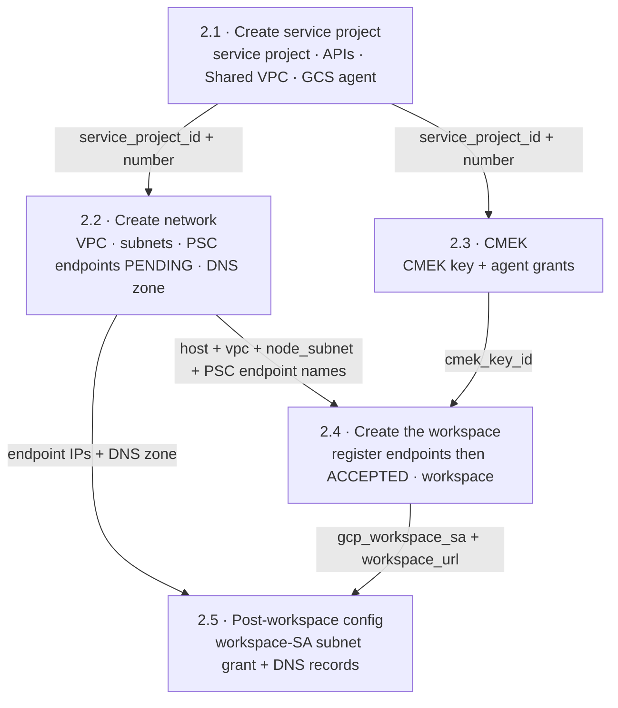

# 2. Workspace Setup

> ← Back to the [PoC playbook](../README.md)

**Purpose:** stand up a secure Databricks workspace on a GCP Shared VPC — private
connectivity (PSC), customer-managed encryption (CMEK), and no public exposure.
**Owner:** split across the platform teams (see the map below).
**Produces:** a running workspace — its URL, id, and workspace service account — ready for
data access (Phase 3).

The work is **split across teams** — each team runs one Terraform config with only its own
least-privilege identity, and teams hand off **data** (Terraform outputs), never shared
credentials or shared state.

Each step below links to its config's README for the full inputs, outputs, and commands.

---

## Team ↔ step map

| Step | Config / resources | Team | Standing identity it needs |
|---|---|---|---|
| **2.1 · Create service project** | [`service-project/`](service-project/README.md) — create the service project, enable its APIs, attach it to the existing Shared VPC host, provision the GCS service agent. The **host project already exists** (and its APIs are already enabled) | **Cloud Foundation / Landing Zone** | org/folder: `resourcemanager.projectCreator`, `billing.user`, `compute.xpnAdmin`, `resourcemanager.projectIamAdmin` |
| **2.2 · Create network** | [`network/`](network/README.md) — VPC, subnets, firewall, router, NAT, PSC IPs + forwarding rules, DNS **zone**, static service-agent subnet grants | **Network Engineering** | `compute.networkAdmin` + `compute.securityAdmin` + `dns.admin` on **HOST** |
| **2.3 · CMEK** | [`cmek/`](cmek/README.md) — keyring, key, grants to service-project compute-system + gs-project-accounts agents | **Cloud Security / KMS** | `cloudkms.admin` on **SERVICE** |
| **2.4 · Create the workspace** | [`workspace/`](workspace/README.md) — VPC-endpoint regs, private access settings, network config, CMEK registration, workspace, metastore assignment | **Data / Databricks Platform** | Databricks **account admin** — no GCP project roles (this step only calls the account API) |
| **2.5 · Post-workspace config** | [`post-workspace/`](post-workspace/README.md) — workspace-SA `networkUser` subnet grant + DNS **records** (4 A-records) | **Network Engineering / Cloud IAM** | `compute.networkAdmin` + `dns.admin` on **HOST** |

> Customer identities and groups arrive earlier, in **Phase 1.2 (IdP Sync)** — they're
> already in the account by the time you reach here. Assigning a synced group as workspace
> `ADMIN` is a one-line account-API step the Data Platform team can do any time after 2.4
> (until then, the account admin from Phase 1 is already a full workspace admin).

> The role names above are the least-privilege set — use **predefined** roles, not a
> hand-built custom role: two permissions the deploy needs — `compute.forwardingRules.pscCreate`
> and `dns.networks.bindPrivateDNSZone` — can't be added to a custom role (they're silently
> dropped), so a custom "creator" role perpetually 403s.

---

## Why it's a pipeline, not five independent buttons

Three dependencies cross team boundaries. They are the reason the steps are ordered:

1. **PSC status is a two-team round-trip.** Network Eng creates the forwarding rules
   in step 2.2; they sit **PENDING**. They flip to **ACCEPTED** only after the Data
   Platform team *registers* those endpoints in the Databricks account (step 2.4),
   which auto-approves the connection. So "verify `ACCEPTED`" is a Network-Eng check
   performed **after** step 2.4.
2. **The workspace SA doesn't exist until the workspace does.** `db-<workspace-id>@prod-gcp-<region>`
   is minted by step 2.4, but it needs `roles/compute.networkUser` on the **host**
   subnet — Network Eng's resource. That grant is therefore step 2.5 (a handback),
   not step 2.2. Clusters cannot launch until it lands.
3. **DNS records need both sides.** The A-records need the PE IPs (step 2.2) **and**
   the workspace URL (step 2.4), so the *records* are step 2.5 even though the *zone*
   is step 2.2.

Everything else is parallel: **steps 2.2 and 2.3 are independent** (network vs. KMS).

---

## Ordering with handoffs



Steps 2.2 and 2.3 branch off step 2.1 with no edge between them, so they run in parallel.
Registering the endpoints in step 2.4 is what flips the step-2.2 PSC forwarding rules from
**PENDING** to **ACCEPTED**. Step 2.5 is the handback that makes clusters able to launch and
hostnames resolve.

---

## Step-by-step

Each step heading links to its config's README, which has the full inputs, outputs, and
exact commands. The summaries below are the cross-step view.

### 2.1 — Cloud Foundation / Landing Zone → [`service-project/`](service-project/README.md)

Runs with an org/folder-level identity. The **host project already exists** and is only
referenced; this config creates and wires everything else the later steps assume:

1. **Create the service project** (`google_project`) under an org or folder, linked to a
   billing account.
2. **Enable the APIs** on the service project (`compute, dns, cloudkms, iam, iamcredentials,
   cloudresourcemanager, serviceusage, storage`). The host's APIs are already enabled.
3. **Attach to the Shared VPC** — attach the service project to the existing Shared VPC host
   (`roles/compute.xpnAdmin`).
4. **Provision the service agents** — the GCS agent via a data source, and the compute
   agent by enabling the Compute API — so step 2.3's CMEK grants don't fail with
   `400 does not exist`.

**Handoff (outputs):** `service_project_id`, `service_project_number`, `host_project`.

### 2.2 — Network Engineering → [`network/`](network/README.md)

Runs with a host-project network identity. The host project and the Shared VPC association
already exist (step 2.1); this config only creates the network **inside** the host project.

1. `network.tf` — VPC (custom mode), node subnet (`/24`, Private Google Access on),
   PSC subnet (`/28`), firewall (`allow_internal`, `node_to_psc`), router + NAT.
2. `psc.tf` — two internal IPs from the PSC subnet + two forwarding rules targeting the
   region's Databricks service attachments (frontend `plproxy`, backend `ngrok`). These
   will report **PENDING** until step 2.4.
3. `dns.tf` — the **private zone** for `gcp.databricks.com.` bound to the VPC. (Records
   come in step 2.5.)
4. `iam.tf` — the **static** subnet `networkUser` grants to the service
   project's `<num>@cloudservices` and `service-<num>@compute-system` agents (these need
   only the service project number, no workspace).

**Handoff (outputs):** `host_project`, `vpc_name`, `node_subnet_name`, `workspace_pe`,
`relay_pe`, `frontend_pe_ip`, `backend_pe_ip`, `private_zone_name`, `dns_name`.

### 2.3 — Cloud Security / KMS → [`cmek/`](cmek/README.md)  *(parallel with step 2.2)*

Runs with `cloudkms.admin` on the service project.

1. `kms.tf` — keyring + crypto key in the **service** project; grant encrypt/decrypt to
   the service project's `compute-system` (VM disks) and `gs-project-accounts` (GCS)
   agents. (The `MANAGED_SERVICES` grant is added by Databricks at registration in
   step 2.4.)

**Handoff (output):** `cmek_key_id` (the full KMS resource id).

### 2.4 — Data / Databricks Platform → [`workspace/`](workspace/README.md)

Runs with the Databricks **account admin** identity. Reads steps 2.1 + 2.2 + 2.3 outputs
(via `terraform_remote_state` or passed tfvars).

1. `databricks.tf` — register both PSC endpoints (`project_id` = **host**), register the
   CMEK key (`use_cases = ["STORAGE","MANAGED_SERVICES"]`), create the private access
   settings (`public_access_enabled` — **immutable**), create the network config
   (`network_project_id` = **host**), then the workspace (`cloud_resource_container` =
   **service**), and the metastore assignment.
2. **Verify:** the step-2.2 PSC forwarding rules should now be **ACCEPTED**. If they are
   still PENDING, the endpoint registration/network config didn't match — reconcile
   before proceeding.

**Handoff (outputs):** `workspace_id`, `workspace_url`, `gcp_workspace_sa`.

### 2.5 — Network Engineering / Cloud IAM handback → [`post-workspace/`](post-workspace/README.md)

Runs with the host-project network identity again. Reads step 2.4 + step 2.2 outputs.

1. `iam.tf` — grant `roles/compute.networkUser` on the host **node subnet** to
   the workspace SA (`gcp_workspace_sa` from step 2.4). Clusters cannot start without this.
2. `dns.tf` — the four A-records: workspace URL / `dp-<num>` / `<region>.psc-auth` →
   frontend IP; `tunnel.<region>` → backend IP.

**Result:** clusters launch (backend relay works) and workspace hostnames resolve to the
private PSC IPs inside the VPC (frontend works).

---

## Running the steps

Each folder is a standard root config; run them in order (step 2.3 can run alongside step 2.2):

```bash
cd service-project     # then network / cmek / workspace / post-workspace
terraform init
terraform apply -var-file=terraform.tfvars
terraform output       # feed the outputs into the next step (see its README's Inputs)
```

## Handoff mechanism

Each root config has its **own backend/state** and its team's pipeline. Downstream
configs read upstream outputs read-only via `terraform_remote_state`:

```hcl
# workspace/ reading the network team's published state (read-only):
data "terraform_remote_state" "network" {
  backend = "gcs"
  config  = { bucket = "example-tfstate-network", prefix = "databricks/network" }
}

# ...then reference, e.g.:
#   data.terraform_remote_state.network.outputs.workspace_pe
#   data.terraform_remote_state.network.outputs.frontend_pe_ip
```

The only thing that crosses a team boundary is published **output data** — never a shared
credential, a shared state file, or a shared over-privileged identity.

## Layout

This folder contains one root config per step, each with its own state, backend, and team identity:

```
service-project/   # 2.1 — Cloud Foundation  (org/folder identity)
network/           # 2.2 — Network Eng        (host-project network identity)
cmek/              # 2.3 — Security / KMS      (service-project cloudkms.admin)
workspace/         # 2.4 — Data Platform       (account-admin identity)
post-workspace/    # 2.5 — Network / IAM       (host-project network identity)
```
