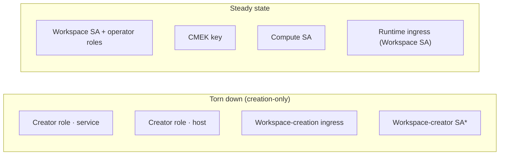

# 2.9 · Tear down the creator identity (End state)

> ← Back to [Workspace Setup](../README.md) · [PoC playbook](../../README.md)

**Purpose:** once the workspace is RUNNING (step 2.8), remove the **creation-only** access —
the two read-only workspace-creator roles, the workspace-creator SA, and the temporary
workspace-creation VPC-SC ingress rule. None of these are used once the workspace exists.
**Owner:** Cloud Foundation + Network Engineering + Databricks account admin.
**Produces:** the least-privilege **steady state** — only the Workspace SA (with its operator
roles), the Compute SA, and the CMEK key remain. No standing account-admin *creator* identity.

This is the **"End state"** in the interactive walkthrough
([klevisa.github.io/databricks-workspace-setup-app](https://klevisa.github.io/databricks-workspace-setup-app/) →
Deployment tab → *End state — least privilege*): the bootstrap identity is torn down.

---

## Why this step exists

The least-privilege flow gives the workspace **creator** SA (`databricks_account_admin_sa`)
only **read-only** roles, needed **only** for step 2.4's settings validation. After step 2.8
finalize, nothing re-reads the projects as that SA — so leaving the roles, the SA, and the
creation-time ingress in place is standing access with no purpose. A security review will
(correctly) flag it. Removing it here is the hygiene that makes the deployment *actually*
least-privilege at rest, not just during creation.

| Created at | Creation-only thing | Removed here |
|---|---|---|
| step 2.1 | Read-only creator role (service project) + binding | ✅ |
| step 2.2 | Read-only creator role (host project) + binding | ✅ |
| step 2.4 | Workspace-creation VPC-SC **ingress** (creator SA, `us-central1` control-plane source) | ✅ |
| prereq 1.1 | Workspace-creator **SA** (`databricks_account_admin_sa`) account-admin registration | ✅ *(see caveat)* |

> **What stays:** the Workspace SA + its operator roles (2.5–2.7), the Compute SA, the CMEK
> key, and the standing workspace-runtime ingress (Workspace SA, regional control-plane
> source). Those are the running workspace's identity — not creation scaffolding.

---

## Prerequisites

- Step **2.8 finalize is complete** — the workspace is `RUNNING` and assigned to the metastore.
- You can re-apply the `service-project/` and `network/` configs (same team identities as 2.1/2.2).
- You have `accesscontextmanager.policyAdmin` on the perimeter (same identity as the
  workspace-creation ingress owner) to remove the ingress rule.

> **Do this after 2.8 and before opening the workspace up to broader use.** It is safe to run
> immediately after finalize — the workspace SA (not the creator SA) owns everything from here on.

---

## Step 1 — Remove the two read-only creator roles

Both roles are gated behind `create_workspace_creator_role` (default `true`). Flip it to
`false` and re-apply — Terraform removes the binding **and** deletes the custom role. This is
declarative (it *stays* removed), unlike a one-off `terraform destroy -target`.

```bash
# Service project (Cloud Foundation, same identity as step 2.1)
cd ../service-project
terraform apply -var-file=terraform.tfvars -var 'create_workspace_creator_role=false'

# Host project (Network Engineering, same identity as step 2.2)
cd ../network
terraform apply -var-file=terraform.tfvars -var 'create_workspace_creator_role=false'
```

Or set `create_workspace_creator_role = false` in each `terraform.tfvars` and `terraform apply`
(preferred — the file then records the End state).

<details>
<summary>Quick alternative: <code>terraform destroy -target</code> (leaves the toggle at true)</summary>

```bash
cd ../service-project
terraform destroy -var-file=terraform.tfvars \
  -target='google_project_iam_member.ws_creator_service[0]' \
  -target='google_project_iam_custom_role.ws_creator_service[0]'

cd ../network
terraform destroy -var-file=terraform.tfvars \
  -target='google_project_iam_member.ws_creator_host[0]' \
  -target='google_project_iam_custom_role.ws_creator_host[0]'
```
Use the toggle instead where you can — a `-target` destroy leaves the resources in config, so
the *next* full apply would recreate them.
</details>

**Verify:**
```bash
gcloud projects get-iam-policy <SERVICE_PROJECT> --flatten=bindings \
  --filter="bindings.role:lpw.databricks.workspace.creator.service.v2" --format='value(bindings.members)'   # → empty
gcloud iam roles list --project=<SERVICE_PROJECT> --filter="name:lpw.databricks.workspace.creator.service.v2"  # → empty
# repeat on <HOST_PROJECT> for lpw.databricks.workspace.creator.host.v2
```

---

## Step 2 — Remove the workspace-creation VPC-SC ingress rule

The workspace-creation ingress (admits the **workspace-creator SA** from the **`us-central1`
control-plane** projects, for step 2.4 validation) lives on **your supplied perimeter**, so it
is not a resource in this repo — remove it directly. Keep the **standing** workspace-runtime
ingress (Workspace SA, regional control-plane source); only the creation one goes.

```bash
# Inspect the perimeter's ingress policies and find the workspace-CREATION rule
gcloud access-context-manager perimeters describe <PERIMETER> \
  --policy=<POLICY_ID> --format=yaml   # locate the ingressFrom whose identity is the CREATOR SA
                                       # and whose sources are the us-central1 control-plane projects

# Remove it — edit the perimeter's ingress-policies file to drop that one rule, then:
gcloud access-context-manager perimeters update <PERIMETER> \
  --policy=<POLICY_ID> \
  --set-ingress-policies=ingress-policies-without-the-creation-rule.yaml
```

If you deploy the perimeter from Terraform/config elsewhere, delete the creation ingress rule
there and apply. **Verify** the creator SA no longer appears in any `ingressFrom.identities`,
and that the `us-central1` control-plane source-pins are gone (they are "only required for
workspace creation").

---

## Step 3 — Remove the workspace-creator SA

`databricks_account_admin_sa` is create-only (steps 2.1–2.8). Phases 3–5 authenticate as the
separate **account-admin service principal** (OAuth M2M, no GCP identity), so the creator SA is
deleted here:

```bash
# a. Deregister it as a Databricks ACCOUNT ADMIN (it federates to a Databricks *user* on GCP)
databricks account users list                 # find the SA's user id (its email)
databricks account users delete <USER_ID>

# b. Disable, then delete, the GCP service account
gcloud iam service-accounts disable <databricks_account_admin_sa>
# after a soak period with no breakage:
gcloud iam service-accounts delete  <databricks_account_admin_sa>
```

> The **account-admin SP** (Phase 1.1) stays until Phase 5 setup completes, then is revoked/deleted
> — nothing in steady-state PoC use needs account admin.

---

## Result — least-privilege steady state



No standing account-admin *creator* identity remains after the workspace is built. Time-boxing
of the **remaining** grants (Workspace SA operator roles, CMEK, data-access bucket IAM) is
handled separately by the `poc_expiry` `request.time` conditions in each of those configs.
